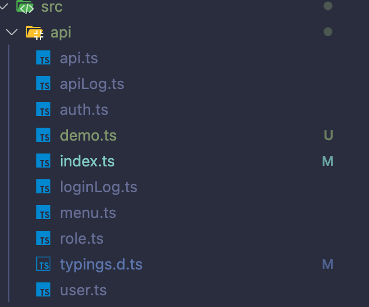

# 前端同步后端 api

后端写完接口后，前端自己不用定义接口调用方法，以及请求参数类型和响应参数类型，直接执行下面命令可以一键生成。

```bash
npm run openapi2ts
```

::: tip 提示
这个命令使用的是 [openapi2typescript](https://github.com/chenshuai2144/openapi2typescript)这个库，可以根据 OpenApi3 文档生成 request 请求代码。
:::

命令执行后会在 `src/api` 目录下生成 `api.ts` 文件，里面是所有接口的调用方法，以及请求参数类型和响应参数类型。



如果后端有新增接口，可以执行 `npm run openapi2ts` 命令重新生成 `api.ts` 文件。

举个例子

```ts
import {user_page} from '@/api/user';
async function getUsers() {
  const users = await user_page({
    page: 1,
    size: 10,
  });
}
```

自动生成的 user_page 方法代码

```ts
/** 分页查询 GET /user/page */
export async function user_page(
  // 叠加生成的Param类型 (非body参数swagger默认没有生成对象)
  params: API.userPageParams,
  options?: {[key: string]: any}
) {
  return request<API.UserPageVO>('/user/page', {
    method: 'GET',
    params: {
      ...params,
    },
    ...(options || {}),
  });
}
```

有参数类型和响应值类型，如果后端接口改参数了，因为使用了 `typescript` 我们可以第一时间发现，不用担心后端改了参数，前端不知道的问题了。

::: warning 注意
执行命里需要给后端启动起来，因为需要调用后端的 swagger 数据，才能生成代码。

另外可以在`openapi2ts.config.ts`文件中修改 `schemaPath` 来指定 swagger 文档地址。
:::
