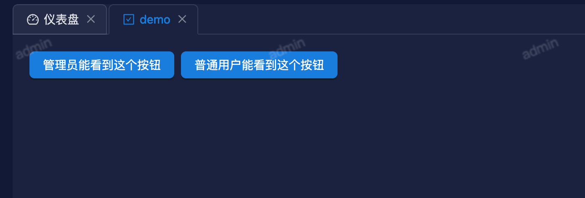
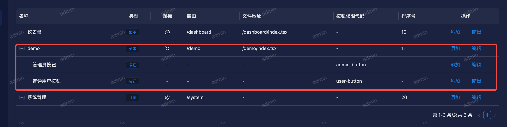
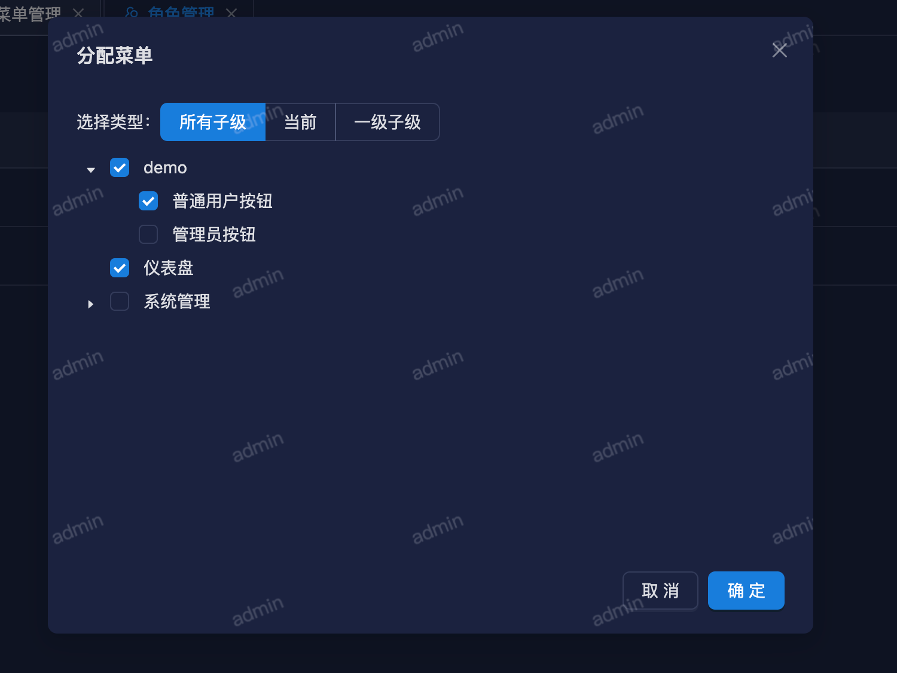
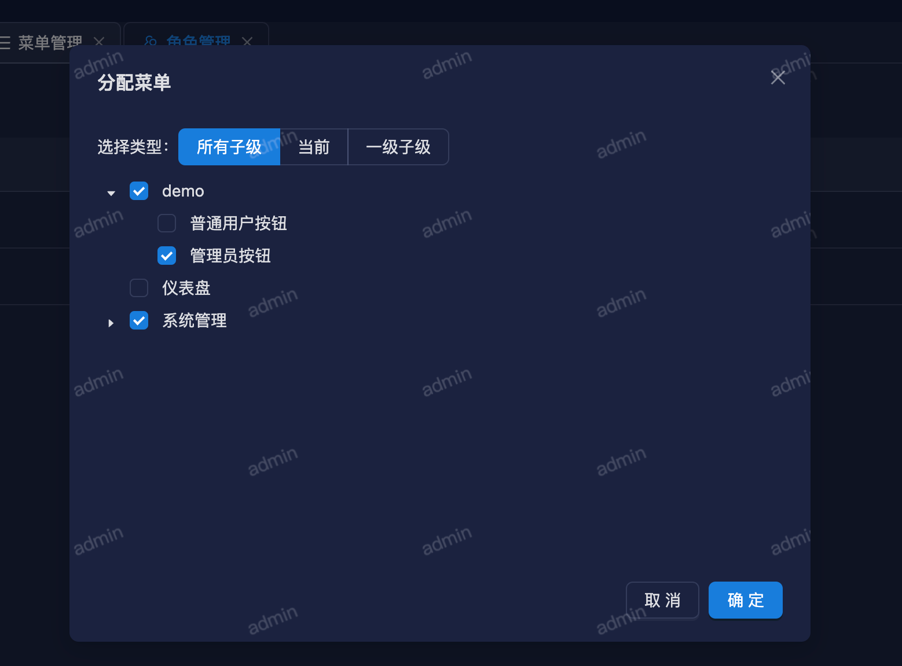
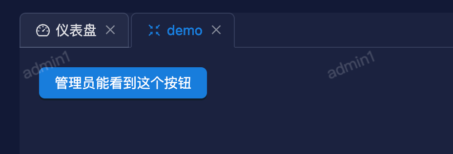
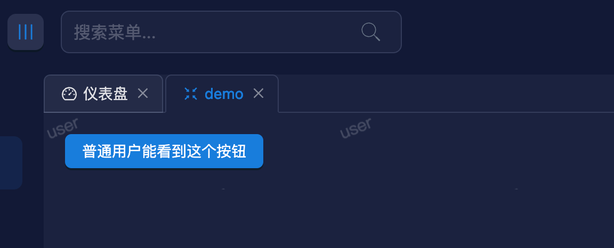

# 按钮权限

如果我们想实现一个需求，同一个页面，不同角色看到的内容不一样，那么我们就需要用到按钮权限了。

## 举个例子

```tsx [index.tsx]
import { Button, Space } from 'antd';

export default function DemoPage() {
  return (
    <Space className='p-[20px]'>
      <Button type='primary'>管理员能看到这个按钮</Button>
      <Button type='primary'>普通用户能看到这个按钮</Button>
    </Space>
  )
}
```



在菜单管理中创建两个按钮权限，分别分配给管理员角色和普通用户角色。



给普通用户角色分配普通用户按钮权限



给管理员角色分配管理员按钮权限



修改代码，同 `v-auth` 指令给按钮绑定权限编码

```tsx [index.tsx]
import { Button, Space } from 'antd';

export default function DemoPage() {
  return (
    <Space className='p-[20px]'>
      <Button v-auth="admin-button" type='primary'>管理员能看到这个按钮</Button>
      <Button v-auth="user-button" type='primary'>普通用户能看到这个按钮</Button>
    </Space>
  )
}
```

运行项目，登录管理员角色账号，可以看到管理员按钮



普通用户登录，可以看到普通用户按钮



::: tip 提示
v-auth指令，可以用于所有组件以及原生 html 元素。
:::

## 最后

如果想了解 v-auth指令是如何实现的，可以看一下这篇文章。

> [竟然可以在react中使用vue指令，快来看看吧](https://juejin.cn/post/7219862257644732473)
