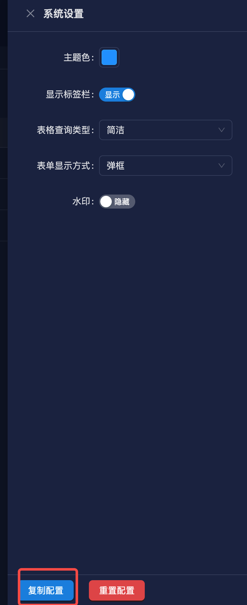

# 项目配置

## 后端项目配置

项目中存在两个配置文件

- src/config/config.default.ts 表示默认配置文件
- src/config/config.prod.ts 表示生产环境配置文件

**默认配置文件是所有环境通用的，生产环境配置文件是生产环境专用的，所以生产环境配置文件会覆盖默认配置文件。**

配置文件中很多参数都是取的环境变量，所以可以在 `.env` 文件中定义环境变量。

因为.env 文件中存放的都是敏感信息，所以不建议上传到仓库中，直接给忽略了。

大家可以在本地根目录下创建.env 文件，env 内容可以使用下面的模板

```bash
# 数据库ip
DB_HOST=localhost
# 数据库端口
DB_PORT=3306
# 数据库用户名
DB_USERNAME=root
# 数据库密码
DB_PASSWORD=12345678
# 数据库名
DB_NAME=fluxy-admin

# redis ip
REDIS_HOST=localhost
# redis 端口
REDIS_PORT=6379
# redis 密码
REDIS_PASSWORD=

# minio
MINIO_HOST=localhost
MINIO_PORT=9002
MINIO_ACCESS_KEY=root
MINIO_SECRET_KEY=12345678
MINIO_BUCKET_NAME=fluxy-admin

# 邮箱服务器配置
MAIL_HOST=smtp.163.com
MAIL_PORT=465
MAIL_USER=
MAIL_PASS=
```

## 前端配置

启动前端项目后，右下角有一个配置图标，点击可以修改一些配置和主题。

::: tip 提示
这个配置按钮只会在开发环境显示，打包后不会显示。
:::

如果修改的配置想在生产环境中也生效，可以点击下面的复制配置按钮，复制当前配置到剪贴板，然后覆盖项目里的`src/default-setting.ts`文件就行了。



```ts [src/default-setting.ts]
import {SystemSettingType} from './interface';

export const defaultSetting = {
  // 主题色
  primaryColor: 'rgb(24,144,255)',
  // 过滤器类型
  filterType: 'light',
  // 显示表单类型
  showFormType: 'modal',
  // 是否显示标签页
  showKeepAliveTab: true,
  // 系统标题
  title: 'fluxy-admin',
  // 系统描述
  description: '高颜值后台管理系统',
  // 头部高度
  headerHeight: 80,
  // 侧边栏宽度
  slideWidth: 240,
  // 侧边栏折叠宽度
  collapsedSlideWidth: 112,
  // 移动端边距
  mobileMargin: 16,
  // 是否显示水印
  showWatermark: false,
  // 水印位置
  watermarkPos: 'content',
  // 语言列表
  languages: [
    {
      key: 'zh',
      name: '中文',
    },
    {
      key: 'en',
      name: 'English',
    },
  ],
  defaultLang: 'zh',
} as SystemSettingType;
```
