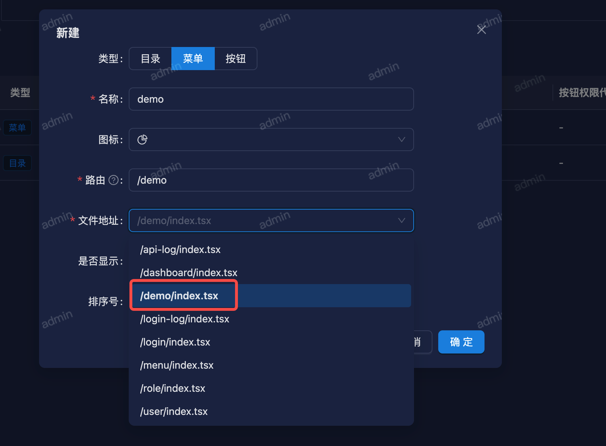
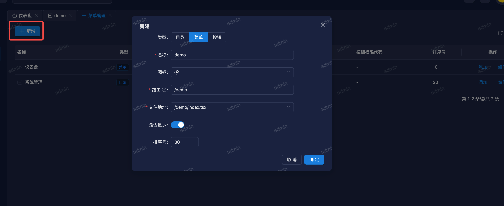
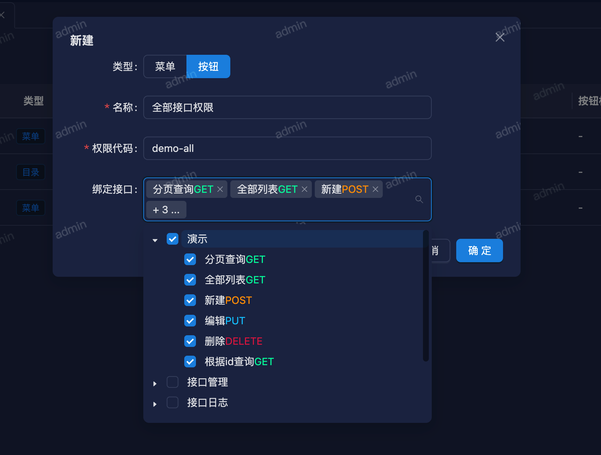
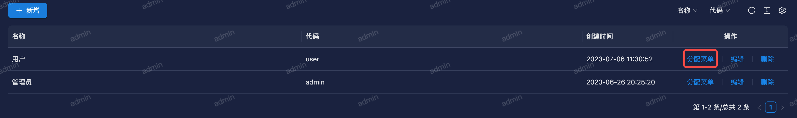
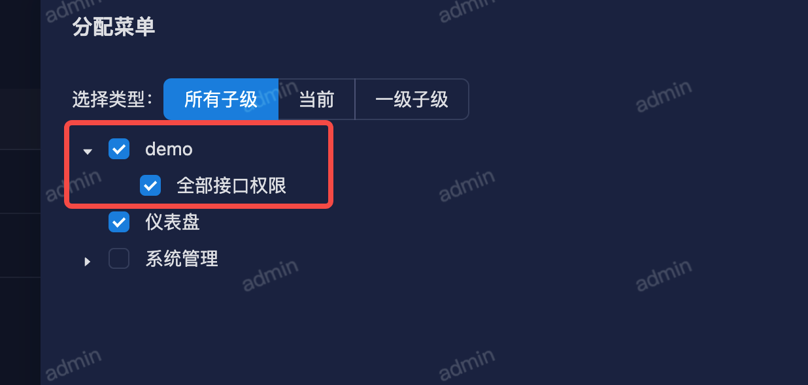

# 菜单配置

前端开发完页面之后，需要在菜单管理功能中，新增一个菜单，然后才能显示出来。

比如刚开发了一个 `demo/index.tsx` 页面，现在需要在菜单管理中添加进来。

::: tip 提示
这里文件地址只能选择文件名为 `index.tsx`, 所以我们在开发功能时，菜单入口文件名必须命名为`index.tsx`。
:::

接下来给菜单绑定接口权限，不然进入页面调用接口会报错。

::: tip 提示
这里添加的按钮可以理解为权限集。
:::

保存成功后，如果使用超级管理员账号，刷新完页面就能看到菜单。

如果是普通用户，必须给当前用户角色分配刚加的功能。

找到当前用户对应的角色，然后给该角色分配刚添加的功能。

这里如果不勾选下面的接口权限，虽然能看到菜单，但是点击去接口会报错。

保存成功后，使用普通用户账号登录，也能看到新加的功能了。
