# 快速开始

## 环境准备

确保你的环境满足以下要求：

- **git**: 你需要 git 来克隆和管理项目版本。

- **NodeJS**: >=18.12.0，推荐 18.19.0 或更高。

- **pnpm**: >= 8.7.0，推荐最新版本。

- **mysql**: >= 8.0.0 或更高版本。

- **redis**: >= 6.0.0 或更高版本。

- **minio**: 任意版本

::: tip 提示

mysql、redis、minio 安装教程可以参考这篇文章。

> [后端框架搭建——从零开始搭建一个高颜值后台管理系统全栈框架(二)](https://juejin.cn/post/7236736926639554615)

:::

### 创建数据库

安装后数据库后，使用数据库连接工具创建一个数据库，名称为 `fluxy-admin`

## 代码获取

### 前端代码获取

```bash
git clone https://github.com/dbfu/fluxy-admin-web.git
```

### 后端代码获取

```bash
git clone https://github.com/dbfu/fluxy-admin-server.git
```

## 运行后端项目

### 安装后端依赖

```sh
pnpm i
```

### 配置环境变量

在项目根目录下创建.env 文件

```sh
# 数据库ip
DB_HOST=localhost
# 数据库端口
DB_PORT=3306
# 数据库用户名
DB_USERNAME=root
# 数据库密码
DB_PASSWORD=12345678
# 数据库名
DB_NAME=fluxy-admin

# redis ip
REDIS_HOST=localhost
# redis 端口
REDIS_PORT=6379
# redis 密码
REDIS_PASSWORD=

# minio
MINIO_HOST=localhost
MINIO_PORT=9002
MINIO_ACCESS_KEY=root
MINIO_SECRET_KEY=12345678
MINIO_BUCKET_NAME=fluxy-admin

# 邮箱服务器配置
MAIL_HOST=smtp.163.com
MAIL_PORT=465
MAIL_USER=
MAIL_PASS=
```

### 启动后端服务

1. **使用命令启动后端服务**

   ```sh
   npm run dev
   ```

2. **使用 vscode 启动后端服务**

   使用 vscode 编辑器打开项目，然后使用`F5`快捷键启动后端服务

   或在 vscode 侧边栏 中点击`运行和调试` -> `开始调试`
   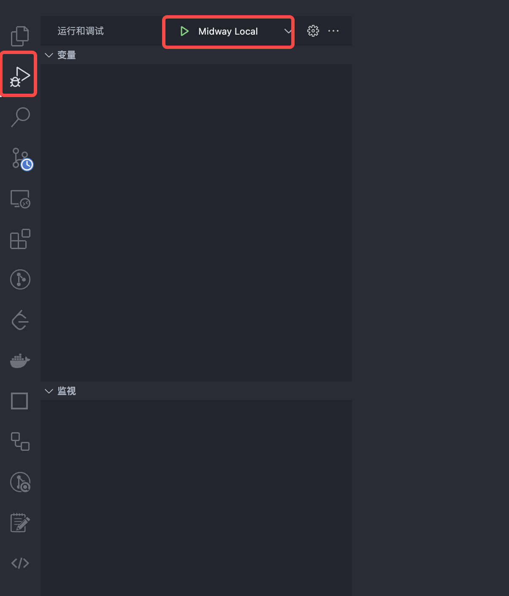

::: tip 提示

**启动项目前，必须启动数据库、redis、以及 minio 服务。**

:::

启动成功后，可以看到以下页面

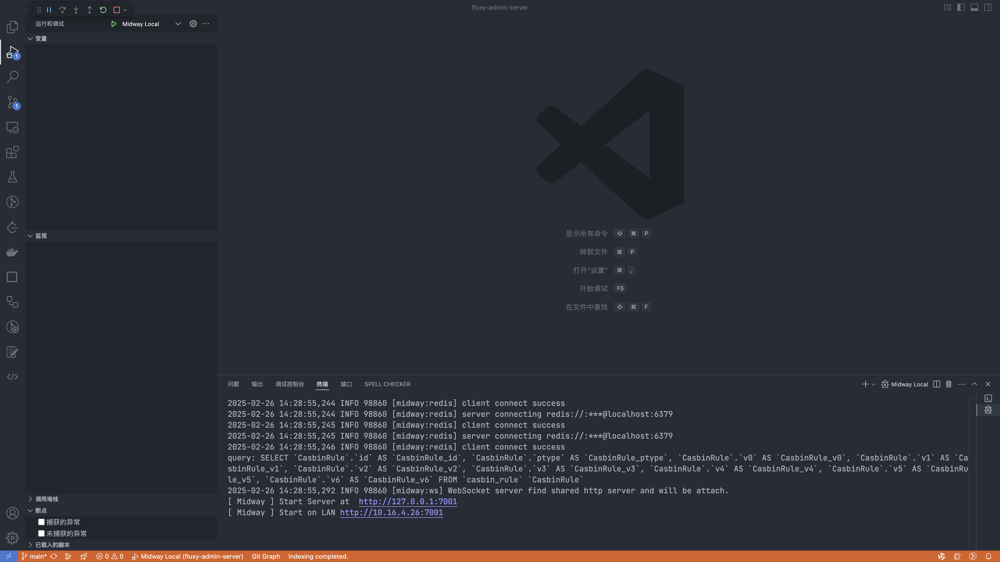

访问 <http://127.0.0.1:7001/swagger-ui/index.html#> 查看接口文档

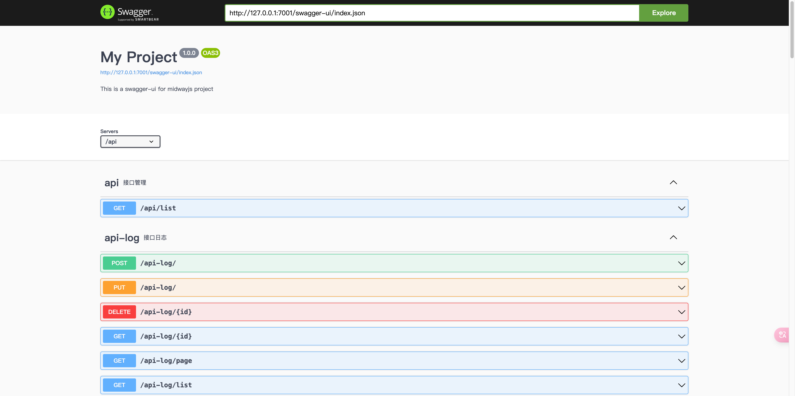

自动生成数据库表，以及一些初始化数据。

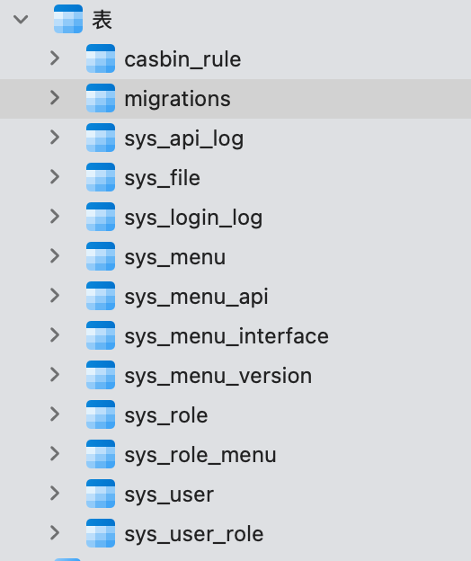

## 运行前端项目

### 安装前端依赖

```sh
pnpm i
```

### 启动前端服务

安装依赖后，使用命令启动前端服务

```sh
npm run dev
```

启动成功后，访问 <http://127.0.0.1:5173/>，会进入登录页面。

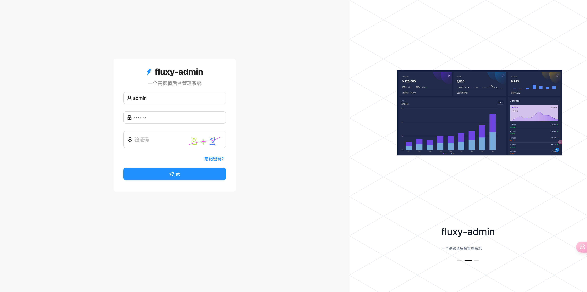

系统内置两个账号，一个是超级管理员账号，一个普通用户账号。

- 超级管理员账号：admin
- 超级管理员密码：123456

- 普通用户账号：user
- 普通用户密码：123456

## 编写后端代码

### 使用脚本初始化一个新模块

```sh
node ./script/create-module demo demo demo 演示
```

::: info 脚本有 4 个参数：

第一个是模块名称

第二个是功能名称

第三个是表字段前缀

第四个是功能中文描述

:::

执行成功后，会自动创建一些文件

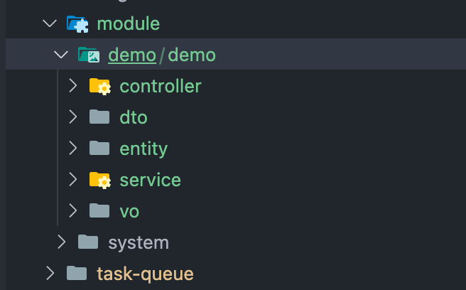

默认会对外暴露增删改查接口

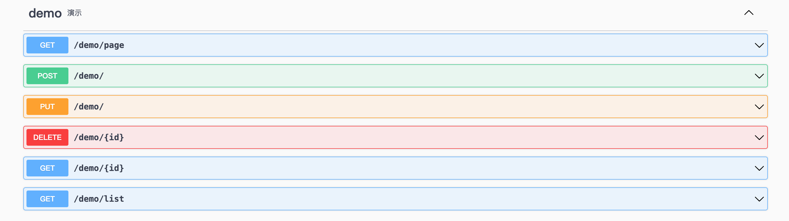

### 目录结构介绍

```text
├── controller            // 定义接口
│   └── demo.ts
├── dto                   // 校验前端传过来的数据
│   ├── demo-page.ts
│   └── demo.ts
├── entity                // 定义数据库实体
│   └── demo.ts
├── service               // 实现业务逻辑，和数据库实体交互
│   └── demo.ts
└── vo                    // 定义返回给前端的数据
    ├── demo-page.ts
    └── demo.ts
```

### 修改数据库实体

默认创建的实体有两个字段，这里我们再添加一个

```typescript [/entity/demo.ts]
import { Entity, Column } from 'typeorm';
import { BaseEntity } from '../../../../common/base-entity';

@Entity('demo_demo')
export class DemoEntity extends BaseEntity {
  @Column({ comment: '名称' })
  name?: string;
  @Column({ comment: '代码' })
  code?: string;
  @Column({ comment: '描述' }) // [!code ++]
  description?: string; // [!code ++]
}
```

### 修改返回给前端的数据结构

```typescript [/vo/demo.ts]
import { ApiProperty } from '@midwayjs/swagger';
import { BaseVO } from '../../../../common/base-vo';

export class DemoVO extends BaseVO {
  @ApiProperty({
    description: '代码',
  })
  code?: string;
  @ApiProperty({
    description: '名称',
  })
  name?: string;
  @ApiProperty({         // [!code ++]
    description: '描述',  // [!code ++]
  })
  description?: string;  // [!code ++]
}

```

### 修改校验前端传过来的数据结构

```typescript [/dto/demo.ts]
import { Rule } from '@midwayjs/validate';
import { ApiProperty } from '@midwayjs/swagger';
import { DemoEntity } from '../entity/demo';
import { BaseDTO } from '../../../../common/base-dto';
import { requiredString } from '../../../../common/common-validate-rules';
import { R } from '../../../../common/base-error-util';

export class DemoDTO extends BaseDTO<DemoEntity> {
  @ApiProperty({
    description: '代码',
  })
  @Rule(requiredString.error(R.validateError('代码不能为空')))
  code?: string;
  @ApiProperty({
    description: '名称',
  })
  @Rule(requiredString.error(R.validateError('名称不能为空')))
  name?: string;
  @ApiProperty({ // [!code ++]
    description: '描述', // [!code ++]
  }) // [!code ++]
  @Rule(requiredString.error(R.validateError('描述不能为空'))) // [!code ++]
  description?: string; // [!code ++]
}
```

### 新加一个接口

随便加一个接口，比如返回描述

```typescript [/controller/demo.ts]
...

@Controller('/demo', { description: '演示' })
export class DemoController {
  @Inject()
  demoService: DemoService;

  ...

  @Get('/description', { description: '返回描述不等于hello所有demo数据' }) // [!code ++]
  @ApiOkResponse({ // [!code ++]
    type: DemoVO, // [!code ++]
    isArray: true, // [!code ++]
  }) // [!code ++]
  async filterDescription() { // [!code ++]
    return await this.demoService.filterDescription(); // [!code ++]
  } // [!code ++]
}

```

### 修改 service

在 service 中新增一个`filterDescription`方法

```typescript [/service/demo.ts]
...

@Provide()
export class DemoService extends BaseService<DemoEntity> {
  @InjectEntityModel(DemoEntity)
  demoModel: Repository<DemoEntity>;

  getModel(): Repository<DemoEntity> {
    return this.demoModel;
  }

  async filterDescription() { // [!code ++]
    return await this.demoModel.find({ // [!code ++]
      where: { // [!code ++]
        description: Not('hello'), // [!code ++]
      },// [!code ++]
    });// [!code ++]
  }// [!code ++]
}
```

### 启动项目测试

启动项目后，发现数据库表已经生成了，新加的接口也可以生效了。

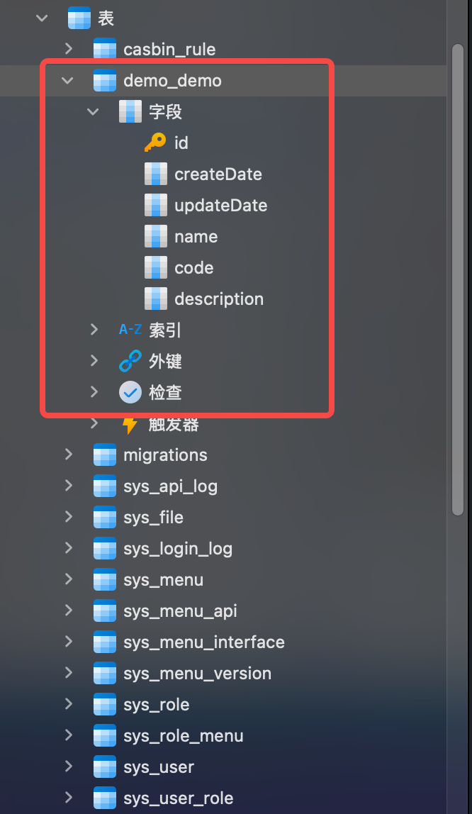

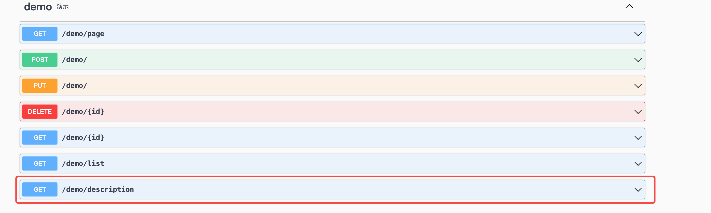

## 编写前端代码

### 同步接口

执行下面命令，可以直接通过后端 swagger 文档，生成前端调用的接口方法，以及 typescript 类型定义。

```sh
npm run openapi2ts
```

执行成功后，会在`/src/api`目录下生成一个`demo.ts`文件，里面有后端接口的调用方法，以及 typescript 类型定义。

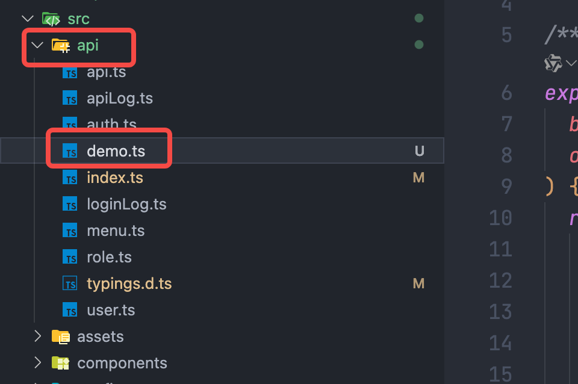

::: details 查看代码

```ts
// @ts-ignore
/* eslint-disable */
import request from "@/request";

/** 编辑 PUT /demo/ */
export async function demo_edit(
  body: API.DemoDTO,
  options?: { [key: string]: any }
) {
  return request<any>("/demo/", {
    method: "PUT",
    headers: {
      "Content-Type": "application/json",
    },
    data: body,
    ...(options || {}),
  });
}

/** 新建 POST /demo/ */
export async function demo_create(
  body: API.DemoDTO,
  options?: { [key: string]: any }
) {
  return request<any>("/demo/", {
    method: "POST",
    headers: {
      "Content-Type": "application/json",
    },
    data: body,
    ...(options || {}),
  });
}

/** 根据id查询 GET /demo/${param0} */
export async function demo_getById(
  // 叠加生成的Param类型 (非body参数swagger默认没有生成对象)
  params: API.demoGetByIdParams,
  options?: { [key: string]: any }
) {
  const { id: param0, ...queryParams } = params;
  return request<any>(`/demo/${param0}`, {
    method: "GET",
    params: { ...queryParams },
    ...(options || {}),
  });
}

/** 删除 DELETE /demo/${param0} */
export async function demo_remove(
  // 叠加生成的Param类型 (非body参数swagger默认没有生成对象)
  params: API.demoRemoveParams,
  options?: { [key: string]: any }
) {
  const { id: param0, ...queryParams } = params;
  return request<any>(`/demo/${param0}`, {
    method: "DELETE",
    params: { ...queryParams },
    ...(options || {}),
  });
}

/** 返回描述不等于hello所有demo数据 GET /demo/description */
export async function demo_filterDescription(options?: { [key: string]: any }) {
  return request<API.DemoVO[]>("/demo/description", {
    method: "GET",
    ...(options || {}),
  });
}

/** 全部列表 GET /demo/list */
export async function demo_list(
  // 叠加生成的Param类型 (非body参数swagger默认没有生成对象)
  params: API.demoListParams,
  options?: { [key: string]: any }
) {
  return request<API.DemoVO[]>("/demo/list", {
    method: "GET",
    params: {
      ...params,
    },
    ...(options || {}),
  });
}

/** 分页查询 GET /demo/page */
export async function demo_page(
  // 叠加生成的Param类型 (非body参数swagger默认没有生成对象)
  params: API.demoPageParams,
  options?: { [key: string]: any }
) {
  return request<API.DemoPageVO>("/demo/page", {
    method: "GET",
    params: {
      ...params,
    },
    ...(options || {}),
  });
}
```

:::

### 创建页面

可以使用下面脚本快速创建一个增删改查页面，脚本就一个参数，**功能名称**。

```sh

node ./script/create-page demo
```

执行完命令后，`/src/pages`文件夹下会多出 `demo` 文件夹

- `index.tsx` 存放的是列表页面
- `new-and-edit.tsx` 存放的是新增和编辑表单

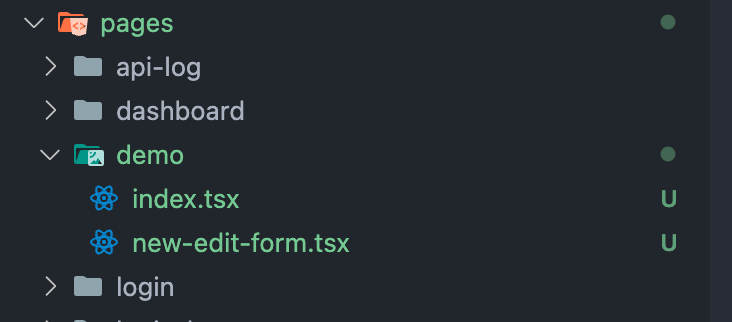

### 表格中添加描述字段

```tsx [demo/index.tsx]
const columns: ProColumnType<API.DemoVO>[] = [
    {
      title: t("qvtQYcfN" /* 名称 */),
      dataIndex: 'name',
    },
    {
      title: t("WIRfoXjK" /* 代码 */),
      dataIndex: 'code',
      valueType: 'text',
    },
    { // [!code ++]
      title: '描述', // [!code ++]
      dataIndex: 'description',  // [!code ++]
      valueType: 'text', // [!code ++]
    }, // [!code ++]
    {
      title: t("QkOmYwne" /* 操作 */),
      dataIndex: 'id',
      hideInForm: true,
      width: 240,
      align: 'center',
      search: false,
      renderText: (id: string, record) => (
        <Space
          split={(
            <Divider type='vertical' />
          )}
        >
          <LinkButton
            onClick={() => {
              setEditData(record);
              setFormOpen(true);
            }}
          >
            {t("wXpnewYo" /* 编辑 */)}
          </LinkButton>
          <Popconfirm
            title={t("RCCSKHGu" /* 确认删除？ */)}
            onConfirm={async () => {
              await demo_remove({ id });
              antdUtils.message?.success(t("CVAhpQHp" /* 删除成功! */));
              actionRef.current?.reload();
            }}
            placement="topRight"
          >
            <LinkButton
            >
              {t("HJYhipnp" /* 删除 */)}
            </LinkButton>
          </Popconfirm>
        </Space>
      ),
    },
  ];
```

### 表单中添加描述字段

修改 `demo/new-and-edit.tsx` 文件:

```tsx [demo/new-and-edit.tsx]

  <FModalForm
    labelCol={{ sm: { span: 24 }, md: { span: 5 } }}
    wrapperCol={{ sm: { span: 24 }, md: { span: 16 } }}
    form={form}
    onFinish={finishHandle}
    open={open}
    title={title}
    width={640}
    loading={updateLoading || createLoading}
    onOpenChange={onOpenChange}
    layout='horizontal'
    modalProps={{ forceRender: true }}
  >
    <Form.Item
      label={t("WIRfoXjK" /* 代码 */)}
      name="code"
      rules={[{
        required: true,
        message: t("jwGPaPNq" /* 不能为空 */),
      }]}
    >
      <Input disabled={!!editData} />
    </Form.Item>
    <Form.Item
      label={t("qvtQYcfN" /* 名称 */)}
      name="name"
      rules={[{
        required: true,
        message: t("iricpuxB" /* 不能为空 */),
      }]}
    >
      <Input />
    </Form.Item>
    // [!code ++]
    <Form.Item label="描述" name="description"> 
      // [!code ++]
      <Input /> 
      // [!code ++]
    </Form.Item> 
  </FModalForm>
```

### 测试调用新加的接口

从 api 中导入方法

```ts
import { demo_filterDescription } from '@/api/demo';
```

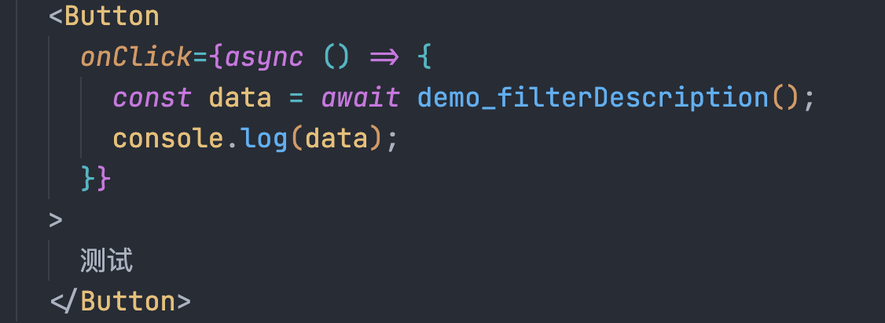

拥有代码提示

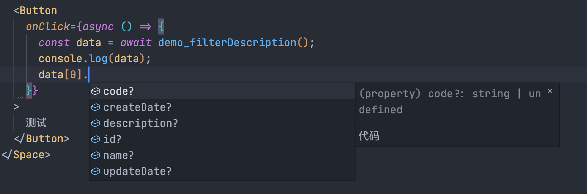

## 配置菜单

上面已经把新功能前后端代码写好了，下面给大家说一下如何让问新功能。

启动项目，进入菜单管理功能，在根目录下新增一个菜单。

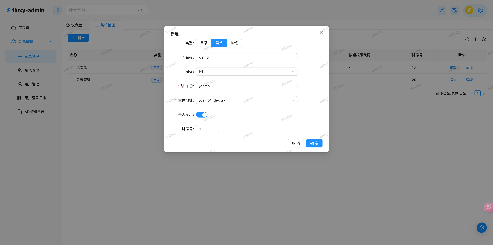

然后刷新页面，然后就能在菜单中看到新增的菜单了。

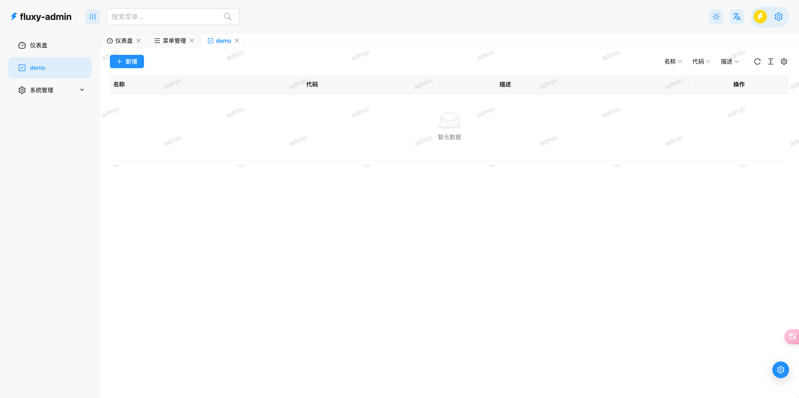

::: tip 提示

这里没有给角色分配当前菜单也能看到，是因为 admin 账号拥有最高权限，不用分配也能看到。

:::

换一个普通角色账号登录，就看不见了。


进入角色管理功能，给对应角色分配刚才创建的菜单。

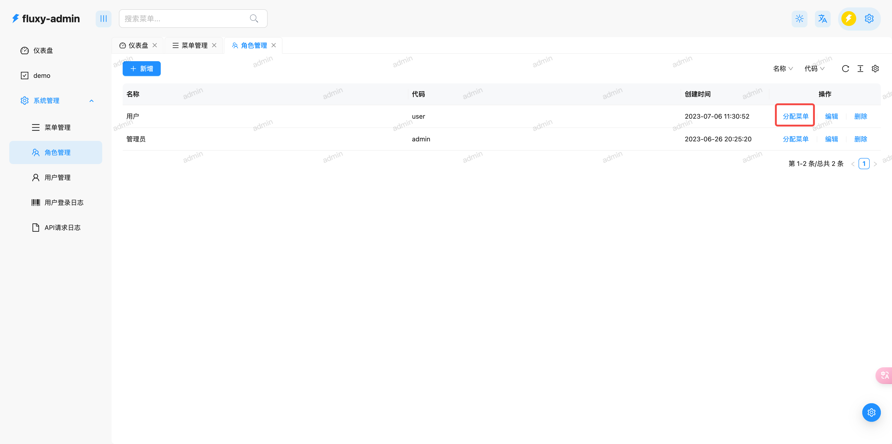

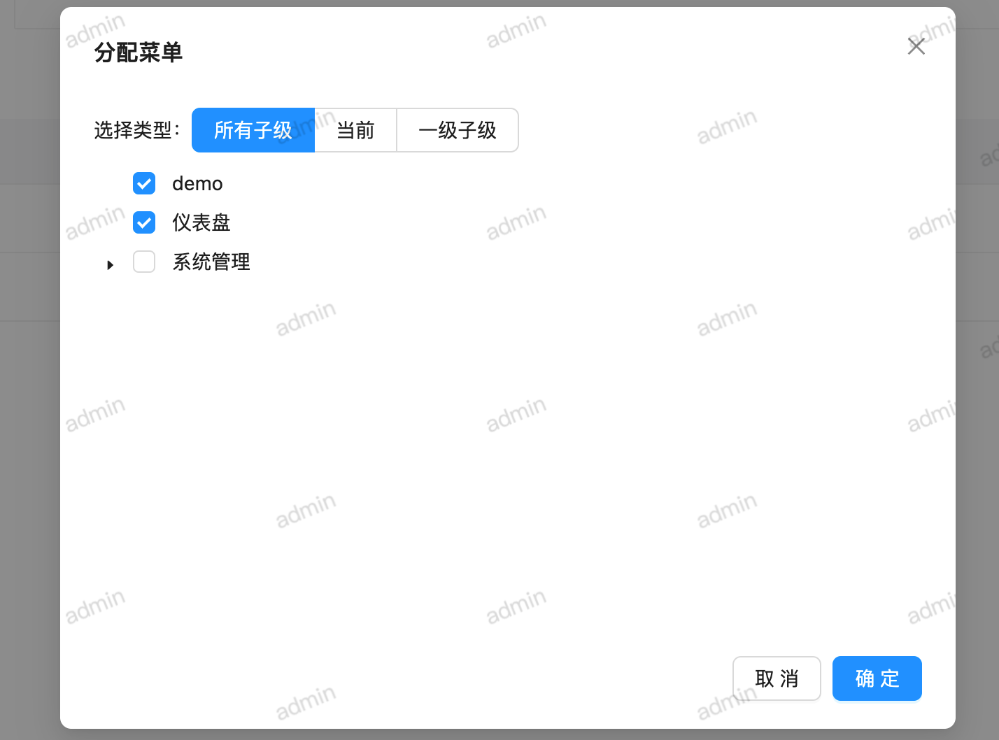

重新登录就能看到菜单了


## 配置接口权限

使用普通用户打开刚才的页面，接口会报错，因为没有配置接口权限，需要给菜单绑定接口。

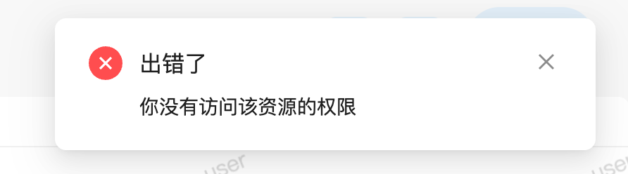

进入菜单管理页面，给当前菜单添加一个按钮，按钮绑定当前页面使用的所有接口。

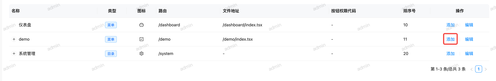

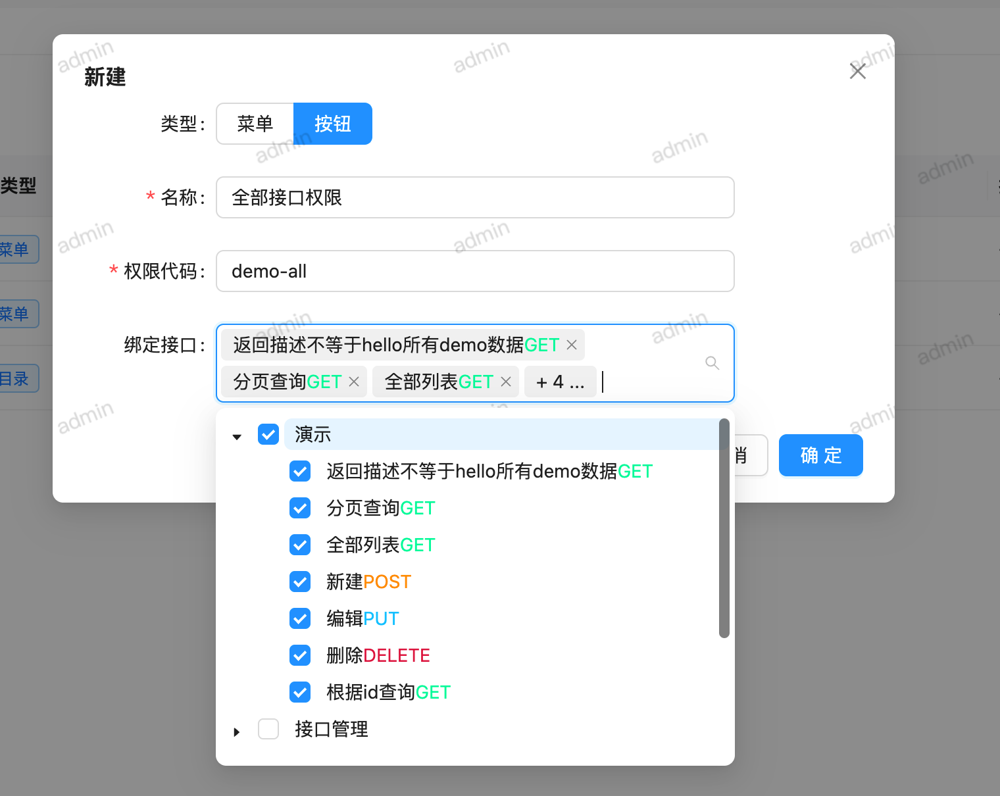

::: tip 提示
这里的按钮不只是对应前端页面的按钮，这个可以理解为一个权限集。
:::

然后到角色管理页面，给角色绑定按钮，页面就能正常访问了。

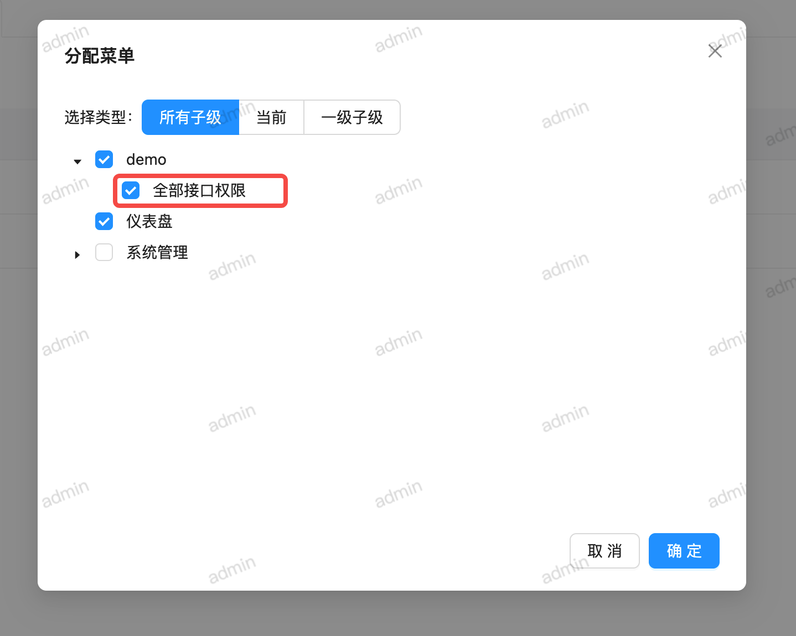

## 国际化

推荐使用项目配套的国际化 vscode 插件，如果没有安装清请先安装。

安装成功后，在需要做国际化的页面中右键，选择`翻译当前页面`，会自动把当前页面里的中文替换为国际化方法。
