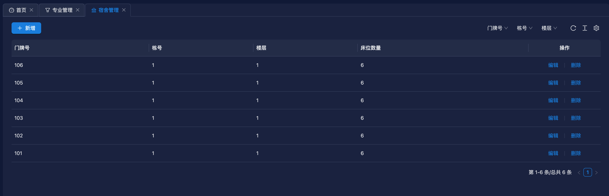
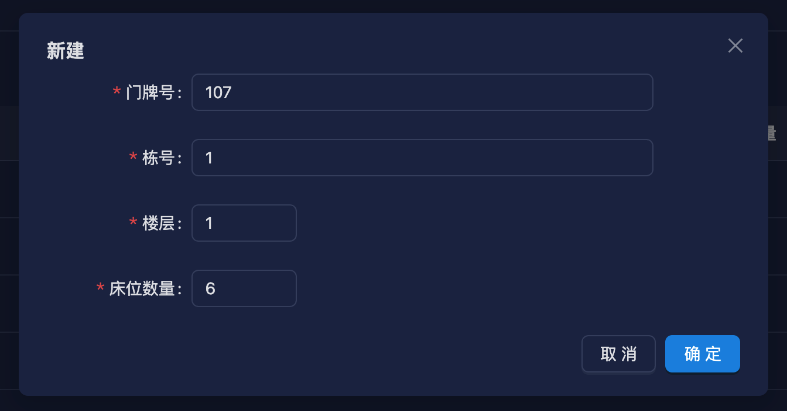

# 宿舍管理功能开发

使用脚本快速生成增删改查模板代码

```bash
node ./script/create-module student-hostel hostel sh 宿舍管理
```

生成模板代码后，修改数据库实体 `entity`

```ts [src/module/student-hostel/hostel/entity/hostel.ts]
import { Column, Entity } from 'typeorm';
import { BaseEntity } from '../../../../common/base-entity';

@Entity('sh_hostel')
export class HostelEntity extends BaseEntity {
  @Column({ comment: '门牌号' })
  number?: string;
  @Column({ comment: '栋号' })
  building?: string;
  @Column({ comment: '楼层' })
  floor?: string;
  @Column({ comment: '床位数量' })
  bedCount?: number;
}
```

修改返回给前端的数据模型 `vo`

```ts [src/module/student-hostel/hostel/vo/hostel.ts]
import { ApiProperty } from '@midwayjs/swagger';
import { BaseVO } from '../../../../common/base-vo';

export class HostelVO extends BaseVO {
  @ApiProperty({ description: '门牌号' })
  number?: string;
  @ApiProperty({ description: '栋号' })
  building?: string;
  @ApiProperty({ description: '楼层' })
  floor?: string;
  @ApiProperty({ description: '床位数量' })
  bedCount?: number;
}
```

修改前端传给后端的数据模型 `dto`，并且加上校验规则

```ts [src/module/student-hostel/hostel/dto/hostel.ts]
import { ApiProperty } from '@midwayjs/swagger';
import { Rule } from '@midwayjs/validate';
import { BaseDTO } from '../../../../common/base-dto';
import { R } from '../../../../common/base-error-util';
import {
  requiredNumber,
  requiredString,
} from '../../../../common/common-validate-rules';
import { HostelEntity } from '../entity/hostel';

export class HostelDTO extends BaseDTO<HostelEntity> {
  @Rule(requiredString.error(R.validateError('门牌号不能为空')))
  @ApiProperty({ description: '门牌号' })
  number?: string;

  @Rule(requiredString.error(R.validateError('栋号不能为空')))
  @ApiProperty({ description: '栋号' })
  building?: string;

  @Rule(requiredNumber.error(R.validateError('楼层不能为空')))
  @ApiProperty({ description: '楼层' })
  floor?: string;

  @Rule(requiredNumber.error(R.validateError('床位数量不能为空')))
  @ApiProperty({ description: '床位数量' })
  bedCount?: number;
}
```

::: tip 注意
@Rule装饰器可以用来校验前端传过来的数据，如果数据不符合规则，则会返回错误信息。
:::

修改 controller，分页查询接口支持门牌号、栋、楼层查询

```ts [src/module/student-hostel/hostel/controller/hostel.ts]
...

  @Get('/page', { description: '分页查询' })
  @ApiOkResponse({
    type: HostelPageVO,
  })
  async page(@Query() hostelPageDTO: HostelPageDTO) {
    const filterQuery = new FilterQuery<HostelEntity>();

    // 添加查询条件
    filterQuery
      .append('number', like(hostelPageDTO.number), !!hostelPageDTO.number)
      .append('building', hostelPageDTO.building, !!hostelPageDTO.building)
      .append('floor', hostelPageDTO.floor, !!hostelPageDTO.floor);

    return await this.hostelService.page(hostelPageDTO, {
      where: filterQuery.where,
      order: { createDate: 'DESC' },
    });
  }
...
```

打开前端项目，执行生成请求接口方法命令，需要把后端项目先启动起来。

```bash
npm run openapi2ts
```

然后执行创建增删改查模板代码命令

```sh
node ./script/create-page hostel
```

修改 index.tsx 文件，修改表格列配置

```tsx [src/pages/hostel/index.tsx]
import { t } from '@/utils/i18n';
import {
  Button,
  Divider,
  Popconfirm,
  Space
} from 'antd';
import { useRef, useState } from 'react';

import { hostel_page, hostel_remove } from '@/api/hostel';
import LinkButton from '@/components/link-button';
import FProTable from '@/components/pro-table';
import { antdUtils } from '@/utils/antd';
import { toPageRequestParams } from '@/utils/utils';
import { PlusOutlined } from '@ant-design/icons';
import { ActionType, ProColumnType } from '@ant-design/pro-components';
import NewAndEditHostelForm from './new-edit-form';

function HostelPage() {
  const actionRef = useRef<ActionType>();

  const [formOpen, setFormOpen] = useState(false);
  const [editData, setEditData] = useState<API.HostelVO | null>(null);
  const openForm = () => {
    setFormOpen(true);
  };

  const closeForm = () => {
    setFormOpen(false);
    setEditData(null);
  };

  const saveHandle = () => {
    actionRef.current?.reload();
    setFormOpen(false);
    setEditData(null);
  };

  const columns: ProColumnType<API.HostelVO>[] = [
    {
      dataIndex: 'number',
      title: '门牌号',
    },
    {
      dataIndex: 'building',
      title: '栋号',
    },
    {
      dataIndex: 'floor',
      title: '楼层',
    },
    {
      dataIndex: 'bedCount',
      title: '床位数量',
      search: false,
    },
    {
      title: t("QkOmYwne" /* 操作 */),
      dataIndex: 'id',
      hideInForm: true,
      width: 200,
      align: 'center',
      search: false,
      renderText: (id: string, record) => (
        <Space
          split={(
            <Divider type='vertical' />
          )}
        >
          <LinkButton
            onClick={() => {
              setEditData(record);
              setFormOpen(true);
            }}
          >
            {t("wXpnewYo" /* 编辑 */)}
          </LinkButton>
          <Popconfirm
            title={t("RCCSKHGu" /* 确认删除？ */)}
            onConfirm={async () => {
              const [error] = await hostel_remove({ id });
              if (!error) {
                antdUtils.message?.success(t("CVAhpQHp" /* 删除成功! */));
                actionRef.current?.reload();
              }
            }}
            placement="topRight"
          >
            <LinkButton>
              {t("HJYhipnp" /* 删除 */)}
            </LinkButton>
          </Popconfirm>
        </Space>
      ),
    },
  ];

  return (
    <>
      <FProTable<API.HostelVO, Omit<API.HostelVO, 'id'>>
        actionRef={actionRef}
        columns={columns}
        request={async params => {
          return hostel_page(toPageRequestParams(params));
        }}
        headerTitle={(
          <Space>
            <Button
              onClick={openForm}
              type='primary'
              icon={<PlusOutlined />}
            >
              {t('morEPEyc' /* 新增 */)}
            </Button>
          </Space>
        )}
      />
      <NewAndEditHostelForm
        onOpenChange={open => !open && closeForm()}
        editData={editData}
        onSaveSuccess={saveHandle}
        open={formOpen}
        title={editData ? t('wXpnewYo' /* 编辑 */) : t('VjwnJLPY' /* 新建 */)}
      />
    </>
  );
}

export default HostelPage;
```

修改 new-edit-form.tsx 文件，修改表单配置

```tsx [src/pages/hostel/new-edit-form.tsx]
import { t } from '@/utils/i18n';
import { Form, Input, InputNumber } from 'antd';
import { useEffect } from 'react';

import { hostel_create, hostel_edit } from '@/api/hostel';
import FModalForm from '@/components/modal-form';
import { antdUtils } from '@/utils/antd';
import { clearFormValues } from '@/utils/utils';
import { useRequest } from 'ahooks';

interface PropsType {
  open: boolean;
  editData?: API.HostelVO | null;
  title: string;
  onOpenChange: (open: boolean) => void;
  onSaveSuccess: () => void;
}

function NewAndEditHostelForm({
  editData,
  open,
  title,
  onOpenChange,
  onSaveSuccess,
}: PropsType) {

  const [form] = Form.useForm();
  const { runAsync: updateUser, loading: updateLoading } = useRequest(hostel_edit, {
    manual: true,
    onSuccess: () => {
      antdUtils.message?.success(t("NfOSPWDa" /* 更新成功！ */));
      onSaveSuccess();
    },
  });
  const { runAsync: addUser, loading: createLoading } = useRequest(hostel_create, {
    manual: true,
    onSuccess: () => {
      antdUtils.message?.success(t("JANFdKFM" /* 创建成功！ */));
      onSaveSuccess();
    },
  });

  useEffect(() => {
    if (!editData) {
      clearFormValues(form);
    } else {
      form.setFieldsValue({
        ...editData,
      });
    }
  }, [editData]);

  const finishHandle = async (values: any) => {
    if (editData) {
      updateUser({ ...editData, ...values })
    } else {
      addUser(values)
    }
  }

  return (
    <FModalForm
      labelCol={{ sm: { span: 24 }, md: { span: 5 } }}
      wrapperCol={{ sm: { span: 24 }, md: { span: 16 } }}
      form={form}
      onFinish={finishHandle}
      open={open}
      title={title}
      width={640}
      loading={updateLoading || createLoading}
      onOpenChange={onOpenChange}
      layout='horizontal'
      modalProps={{ forceRender: true }}
    >
      <Form.Item
        label="门牌号"
        name="number"
        rules={[{
          required: true,
          message: t("iricpuxB" /* 不能为空 */),
        }]}
      >
        <Input />
      </Form.Item>
      <Form.Item
        label="栋号"
        name="building"
        rules={[{
          required: true,
          message: t("iricpuxB" /* 不能为空 */),
        }]}
      >
        <Input />
      </Form.Item>
      <Form.Item
        label="楼层"
        name="floor"
        rules={[{
          required: true,
          message: t("iricpuxB" /* 不能为空 */),
        }]}
      >
        <InputNumber min={1} />
      </Form.Item>
      <Form.Item
        label="床位数量"
        name="bedCount"
        rules={[{
          required: true,
          message: t("iricpuxB" /* 不能为空 */),
        }]}
      >
        <InputNumber min={1} />
      </Form.Item>
    </FModalForm>
  )
}

export default NewAndEditHostelForm;
```

页面多语言，可以参考[国际化](/guide/i18n)。

启动前端项目，配置菜单和接口权限，这个可以参考[菜单配置](/guide/menu-config)。

功能截图




