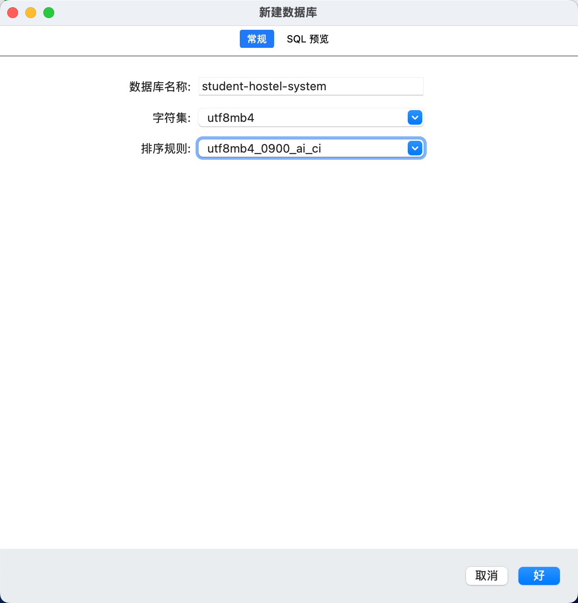

# 项目实战教程

## 前言

为了让大家更好的上手当前框架，熟悉开发流程，所以我写了一套项目实战教程。

下面就直接实战了，项目搭建以及如何启动项目，请在[项目指南](/guide/quick-start)中查看。

## 项目介绍

当前实战项目是一套简易版的学生宿舍管理系统，主要有以下功能：

- 首页报表
- 专业管理
- 宿舍管理
- 学生管理
- 报修管理
- 我的报修

角色分配管理员和学生角色，管理员可以进行专业管理、宿舍管理、学生管理、报修管理，学生可以进行报修。同时管理员角色还能够查看报表。

## 实战项目

### 项目准备

先使用 mysql 数据库连接工具 创建数据库。



在项目根目录下创建.env文件，添加环境变量

```txt
# 数据库ip
DB_HOST=localhost
# 数据库端口
DB_PORT=3306
# 数据库用户名
DB_USERNAME=root
# 数据库密码
DB_PASSWORD=12345678
# 数据库名
DB_NAME=student-hostel-system

# redis ip
REDIS_HOST=localhost
# redis 端口
REDIS_PORT=6379
# redis 密码
REDIS_PASSWORD=

# minio
MINIO_HOST=localhost
MINIO_PORT=9002
MINIO_ACCESS_KEY=root
MINIO_SECRET_KEY=12345678
MINIO_BUCKET_NAME=fluxy-admin

# 邮箱服务器配置
MAIL_HOST=smtp.163.com
MAIL_PORT=465
MAIL_USER=
MAIL_PASS=
```

环境变量添加完成后，然后就可以启动后端项目了。
