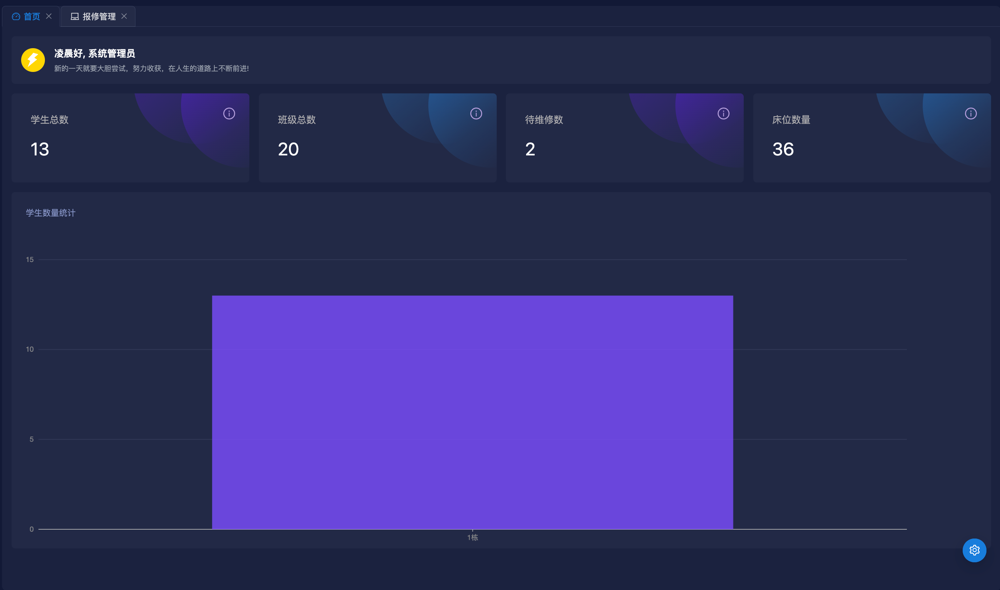
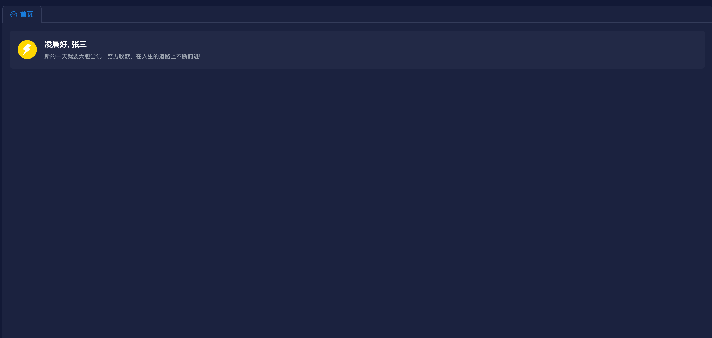

# 首页报表功能开发

现在前端写死的入口菜单是仪表盘，我们可以把仪表盘名字改为首页。

使用脚本快速生成后端增删改查模板代码

```bash
node ./script/create-module student-hostel dashboard sh 首页
```

删除 entity 和 dto 文件，因为不需要。

```ts [src/module/student-hostel/dashboard/controller/dashboard.ts]
import {Controller, Get, Inject} from '@midwayjs/core';
import {ApiOkResponse} from '@midwayjs/swagger';
import {DashboardService} from '../service/dashboard';
import {DashboardDataVO} from '../vo/dashboard';

@Controller('/dashboard', {description: '首页'})
export class DashboardController {
  @Inject()
  dashboardService: DashboardService;

  @Get('/')
  @ApiOkResponse({
    type: DashboardDataVO,
  })
  async getDashboardData() {
    return this.dashboardService.getDashboardData();
  }
}
```

```ts [src/module/student-hostel/dashboard/service/dashboard.ts]
import {Provide} from '@midwayjs/core';
import {InjectEntityModel} from '@midwayjs/typeorm';
import {Repository} from 'typeorm';
import {HostelEntity} from '../../hostel/entity/hostel';
import {MajorEntity} from '../../major/entity/major';
import {RepairEntity} from '../../repair/entity/repair';
import {StudentEntity} from '../../student/entity/student';

@Provide()
export class DashboardService {
  @InjectEntityModel(StudentEntity)
  studentModel: Repository<StudentEntity>;
  @InjectEntityModel(MajorEntity)
  majorModel: Repository<MajorEntity>;
  @InjectEntityModel(RepairEntity)
  repairModel: Repository<RepairEntity>;
  @InjectEntityModel(HostelEntity)
  hostelModel: Repository<HostelEntity>;
  async getDashboardData() {
    const classCount = await this.majorModel
      .createQueryBuilder('t')
      .select('SUM(t.classCount) AS classCount')
      .getRawOne();

    const toRepairCount = await this.repairModel.count({
      where: {
        status: 0,
      },
    });

    const bedCount = await this.hostelModel
      .createQueryBuilder('t')
      .select('SUM(t.bedCount) as bedCount')
      .getRawOne();

    const studentCountByBuilding = await this.studentModel
      .createQueryBuilder('t')
      .leftJoinAndSelect(HostelEntity, 'h', 't.hostelId = h.id')
      .select('h.building as building, COUNT(t.id) as count')
      .groupBy('h.building')
      .orderBy('h.building', 'ASC')
      .getRawMany();

    studentCountByBuilding.forEach((item) => {
      item.count = Number(item.count);
      item.building = `${item.building}栋`;
    });

    return {
      studentCount: await this.studentModel.count(),
      classCount: classCount.classCount,
      toRepairCount,
      bedCount: bedCount.bedCount,
      studentCountByBuilding,
    };
  }
}
```

```ts [src/module/student-hostel/dashboard/vo/dashboard.ts]
import {ApiProperty} from '@midwayjs/swagger';

class StudentCountByBuilding {
  @ApiProperty({description: '楼栋'})
  building: string;

  @ApiProperty({description: '学生数量'})
  count: number;
}

export class DashboardDataVO {
  @ApiProperty({description: '学生数量'})
  studentCount: number;
  @ApiProperty({description: '班级数量'})
  classCount: number;
  @ApiProperty({description: '待维修数量'})
  toRepairCount: number;
  @ApiProperty({description: '床位数量'})
  bedCount: number;
  @ApiProperty({
    description: '每个楼栋的学生数量',
    type: StudentCountByBuilding,
    isArray: true,
  })
  studentCountByBuilding: StudentCountByBuilding[];
}
```

改造前端 `src/pages/dashboard/index.tsx` 文件

```tsx [src/pages/dashboard/index.tsx]
import {Avatar} from 'antd';
import {IconBuguang} from '@/assets/icons/buguang';
import {useUserStore} from '@/stores/user';
import {useShallow} from 'zustand/react/shallow';
import DashboardDetail from './dashborad-detail';
import './index.css';

function Dashboard() {
  const {nickName, avatarPath} = useUserStore(
    useShallow((state) => ({
      nickName: state.currentUser?.nickName,
      avatarPath: state.currentUser?.avatarPath,
    }))
  );

  // 根据时间返回早上好、中午好、下午好、晚上好
  function getGreeting(hour: number): string {
    console.log(hour, 'hour');
    if (hour >= 0 && hour < 6) {
      return '凌晨好';
    } else if (hour >= 6 && hour < 12) {
      return '早上好';
    } else if (hour >= 12 && hour < 18) {
      return '下午好';
    } else {
      return '晚上好';
    }
  }

  return (
    <div className='p-[16px]'>
      <div className='p-[16px] dark:bg-[rgb(33,41,70)] bg-[#fafafa] rounded-md'>
        <div className='flex items-center gap-4'>
          {avatarPath ? (
            <Avatar
              size='large'
              style={{verticalAlign: 'middle'}}
              src={avatarPath}
            />
          ) : (
            <Avatar
              size='large'
              style={{backgroundColor: 'gold', verticalAlign: 'middle'}}
              icon={<IconBuguang />}
            />
          )}
          <div>
            <div className='text-[#252629] dark:text-white font-semibold text-[16px]'>
              {getGreeting(new Date().getHours())}, {nickName}
            </div>
            <div className='text-[#969aa2] dark:text-gray-400 text-[12px] mt-1'>
              新的一天就要大胆尝试，努力收获，在人生的道路上不断前进!
            </div>
          </div>
        </div>
      </div>
      <DashboardDetail v-auth='dashboard-detail' />
    </div>
  );
}

export default Dashboard;
```

`<DashboardDetail v-auth='dashboard-detail' />` 注意这行代码里的 `v-auth='dashboard-detail'`，相当于定义了一个权限，给角色分配这个权限，用户才能看到报表。

```ts [src/pages/dashboard/dashboard-detail.tsx]
import { InfoCircleOutlined } from '@ant-design/icons';
import { Col, Row, Spin, Tooltip } from 'antd';

import DemoColumn from './column';

import { dashboard_getDashboardData } from '@/api/dashboard';
import { useRequest } from 'ahooks';
import './index.css';

function DashboardDetail() {
  const { data, loading } = useRequest(dashboard_getDashboardData);

  if (loading) {
    return (
      <Spin size='large' />
    )
  }

  return (
    <Row className='mt-[16px]' gutter={[16, 16]}>
      <Col lg={24} xl={6} className='w-[100%]'>
        <div className=' dark:bg-[rgb(33,41,70)] w-[100%] bg-[rgb(94,53,177)] overflow-hidden h-[150px] relative rounded-md bg-card p-[32px] box-border'>
          <div className='absolute top-[24px] right-[24px] z-10'>
            <Tooltip title="学生总数">
              <InfoCircleOutlined className='text-[rgb(179,157,219)] text-[20px]' />
            </Tooltip>
          </div>
          <div className="text-[rgba(229,224,216,0.7)] text-[16px]">
            学生总数
          </div>
          <div className="text-white text-2xl mt-[20px] text-[30px]">
            {data?.studentCount}
          </div>
        </div>
      </Col>
      <Col lg={24} xl={6} className='w-[100%]'>
        <div className=' dark:bg-[rgb(33,41,70)] bg-[rgb(30,136,229)] theme1 overflow-hidden h-[150px] relative rounded-md bg-card p-[32px] box-border'>
          <div className='absolute top-[24px] right-[24px] z-10'>
            <Tooltip title="班级总数">
              <InfoCircleOutlined className='text-[rgb(179,157,219)] text-[20px]' />
            </Tooltip>
          </div>
          <div className="text-[rgba(229,224,216,0.7)] text-[16px]">
            班级总数
          </div>
          <div className="text-white text-2xl mt-[20px] text-[30px]">
            {data?.classCount}
          </div>
        </div>
      </Col>
      <Col lg={24} xl={6} className='w-[100%]'>
        <div className=' dark:bg-[rgb(33,41,70)] w-[100%] bg-[rgb(80,53,166)] overflow-hidden h-[150px] relative rounded-md bg-card p-[32px] box-border'>
          <div className='absolute top-[24px] right-[24px] z-10'>
            <Tooltip title="待维修数">
              <InfoCircleOutlined className='text-[rgb(179,157,219)] text-[20px]' />
            </Tooltip>
          </div>
          <div className="text-[rgba(229,224,216,0.7)] text-[16px]">
            待维修数
          </div>
          <div className="text-white text-2xl mt-[20px] text-[30px]">
            {data?.toRepairCount}
          </div>
        </div>
      </Col>
      <Col lg={24} xl={6} className='w-[100%]'>
        <div className=' dark:bg-[rgb(33,41,70)] bg-[rgb(30,136,229)] theme1 overflow-hidden h-[150px] relative rounded-md bg-card p-[32px] box-border'>
          <div className='absolute top-[24px] right-[24px] z-10'>
            <Tooltip title="床位数量">
              <InfoCircleOutlined className='text-[rgb(179,157,219)] text-[20px]' />
            </Tooltip>
          </div>
          <div className="text-[rgba(229,224,216,0.7)] text-[16px]">
            床位数量
          </div>
          <div className="text-white text-2xl mt-[20px] text-[30px]">
            {data?.bedCount}
          </div>
        </div>
      </Col>
      <Col className='w-[100%]' lg={24} xl={24} >
        <div className='dark:bg-[rgb(33,41,70)] bg-white h-[600px] rounded-md p-[24px] relative'>
          <div className='flex justify-between items-center'>
            <div>
              <div className='text-[rgb(132,146,196)]'>学生数量统计</div>
            </div>
          </div>
          <div className='mt-[50px] absolute bottom-[12px] w-[90%] box-border'>
            <DemoColumn data={data?.studentCountByBuilding || []} />
          </div>
        </div>
      </Col>
    </Row>
  )
}

export default DashboardDetail;
```

```tsx [src/pages/dashboard/column.tsx]
import { Column } from '@ant-design/plots';

import { useGlobalStore } from '@/stores/global';

import columnDarkTheme from './theme/dark-column-theme.json';
import columnLightTheme from './theme/light-column-theme.json';

const DemoColumn = ({ data }: { data: any[] }) => {
  const { darkMode } = useGlobalStore();

  const config: any = {
    data,
    xField: 'building',
    yField: 'count',
    height: 480,
    legend: {
      position: 'bottom'
    },
  };

  return <Column theme={darkMode ? columnDarkTheme : columnLightTheme} {...config} />;
};

export default DemoColumn;
```

功能截图

使用管理员账号



普通账号，因为没有分配 `dashboard-detail` 权限，所以看不到报表


