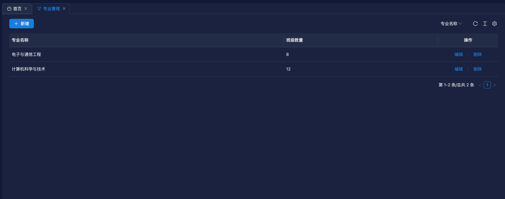
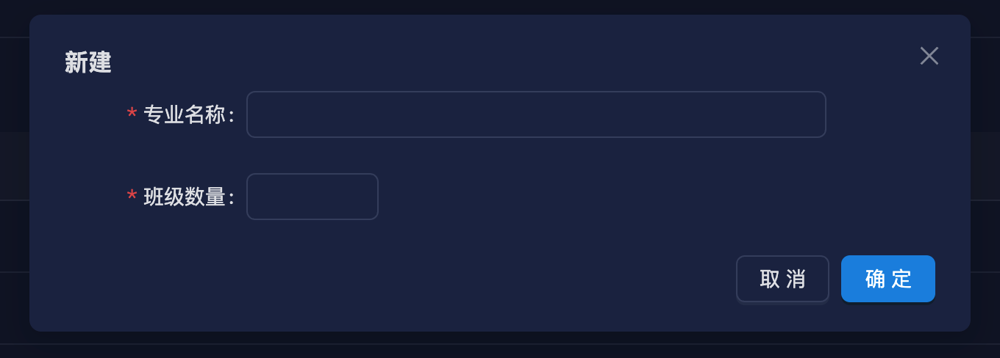

# 专业管理功能开发

使用脚本快速生成增删改查模板代码

```bash
node ./script/create-module student-hostel major sh 专业管理
```

生成模板代码后，修改数据库实体 `entity`

```ts [src/module/student-hostel/major/entity/major.ts]
import {Column, Entity} from 'typeorm';
import {BaseEntity} from '../../../../common/base-entity';

@Entity('sh_major')
export class MajorEntity extends BaseEntity {
  @Column({comment: '专业名称'})
  name: string;
  @Column({comment: '班级数量'})
  classCount: number;
}
```

修改返回给前端的数据模型 `vo`

```ts [src/module/student-hostel/major/vo/major.ts]
import {ApiProperty} from '@midwayjs/swagger';
import {BaseVO} from '../../../../common/base-vo';

export class MajorVO extends BaseVO {
  @ApiProperty({description: '专业名称'})
  name: string;
  @ApiProperty({description: '班级数量'})
  classCount: number;
}
```

修改前端传给后端的数据模型 `dto`，并且加上校验规则

```ts [src/module/student-hostel/major/dto/major.ts]
import {ApiProperty} from '@midwayjs/swagger';
import {Rule} from '@midwayjs/validate';
import {BaseDTO} from '../../../../common/base-dto';
import {R} from '../../../../common/base-error-util';
import {
  requiredNumber,
  requiredString,
} from '../../../../common/common-validate-rules';
import {MajorEntity} from '../entity/major';

export class MajorDTO extends BaseDTO<MajorEntity> {
  @Rule(requiredString.error(R.validateError('专业名称不能为空')))
  @ApiProperty({description: '专业名称'})
  name: string;
  @Rule(requiredNumber.error(R.validateError('班级数量不能为空')))
  @ApiProperty({description: '班级数量'})
  classCount: number;
}
```

::: tip 注意
@Rule 装饰器可以用来校验前端传过来的数据，如果数据不符合规则，则会返回错误信息。
:::

这个功能比较简单，不用修改 service 和 controller 文件里的内容，就能实现增删改查功能。

打开前端项目，执行生成请求接口方法命令，需要把后端项目先启动起来。

```bash
npm run openapi2ts
```

然后执行创建增删改查模板代码命令

```sh
node ./script/create-page major
```

修改 index.tsx 文件，修改表格列配置

```tsx [src/pages/major/index.tsx]
import {t} from '@/utils/i18n';
import {Button, Divider, Popconfirm, Space} from 'antd';
import {useRef, useState} from 'react';

import {major_page, major_remove} from '@/api/major';
import LinkButton from '@/components/link-button';
import FProTable from '@/components/pro-table';
import {antdUtils} from '@/utils/antd';
import {toPageRequestParams} from '@/utils/utils';
import {PlusOutlined} from '@ant-design/icons';
import {ActionType, ProColumnType} from '@ant-design/pro-components';
import NewAndEditMajorForm from './new-edit-form';

function MajorPage() {
  const actionRef = useRef<ActionType>();

  const [formOpen, setFormOpen] = useState(false);
  const [editData, setEditData] = useState<API.MajorVO | null>(null);
  const openForm = () => {
    setFormOpen(true);
  };

  const closeForm = () => {
    setFormOpen(false);
    setEditData(null);
  };

  const saveHandle = () => {
    actionRef.current?.reload();
    setFormOpen(false);
    setEditData(null);
  };

  const columns: ProColumnType<API.MajorVO>[] = [
    {
      dataIndex: 'name',
      title: '专业名称',
    },
    {
      dataIndex: 'classCount',
      title: '班级数量',
      hideInSearch: true,
    },
    {
      title: t('QkOmYwne' /* 操作 */),
      dataIndex: 'id',
      hideInForm: true,
      width: 200,
      align: 'center',
      search: false,
      renderText: (id: string, record) => (
        <Space split={<Divider type='vertical' />}>
          <LinkButton
            onClick={() => {
              setEditData(record);
              setFormOpen(true);
            }}
          >
            {t('wXpnewYo' /* 编辑 */)}
          </LinkButton>
          <Popconfirm
            title={t('RCCSKHGu' /* 确认删除？ */)}
            onConfirm={async () => {
              await major_remove({id});
              antdUtils.message?.success(t('CVAhpQHp' /* 删除成功! */));
              actionRef.current?.reload();
            }}
            placement='topRight'
          >
            <LinkButton>{t('HJYhipnp' /* 删除 */)}</LinkButton>
          </Popconfirm>
        </Space>
      ),
    },
  ];

  return (
    <>
      <FProTable<API.MajorVO, Omit<API.MajorVO, 'id'>>
        actionRef={actionRef}
        columns={columns}
        request={async (params) => {
          return major_page(toPageRequestParams(params));
        }}
        headerTitle={
          <Space>
            <Button onClick={openForm} type='primary' icon={<PlusOutlined />}>
              {t('morEPEyc' /* 新增 */)}
            </Button>
          </Space>
        }
      />
      <NewAndEditMajorForm
        onOpenChange={(open) => !open && closeForm()}
        editData={editData}
        onSaveSuccess={saveHandle}
        open={formOpen}
        title={editData ? t('wXpnewYo' /* 编辑 */) : t('VjwnJLPY' /* 新建 */)}
      />
    </>
  );
}

export default MajorPage;
```

修改 new-edit-form.tsx 文件，修改表单配置

```tsx [src/pages/major/new-edit-form.tsx]
import {t} from '@/utils/i18n';
import {Form, Input, InputNumber} from 'antd';
import {useEffect} from 'react';

import {major_create, major_edit} from '@/api/major';
import FModalForm from '@/components/modal-form';
import {antdUtils} from '@/utils/antd';
import {clearFormValues} from '@/utils/utils';
import {useRequest} from 'ahooks';

interface PropsType {
  open: boolean;
  editData?: API.MajorVO | null;
  title: string;
  onOpenChange: (open: boolean) => void;
  onSaveSuccess: () => void;
}

function NewAndEditMajorForm({
  editData,
  open,
  title,
  onOpenChange,
  onSaveSuccess,
}: PropsType) {
  const [form] = Form.useForm();
  const {runAsync: updateUser, loading: updateLoading} = useRequest(
    major_edit,
    {
      manual: true,
      onSuccess: () => {
        antdUtils.message?.success(t('NfOSPWDa' /* 更新成功！ */));
        onSaveSuccess();
      },
    }
  );
  const {runAsync: addUser, loading: createLoading} = useRequest(major_create, {
    manual: true,
    onSuccess: () => {
      antdUtils.message?.success(t('JANFdKFM' /* 创建成功！ */));
      onSaveSuccess();
    },
  });

  useEffect(() => {
    if (!editData) {
      clearFormValues(form);
    } else {
      form.setFieldsValue({
        ...editData,
      });
    }
  }, [editData]);

  const finishHandle = async (values: any) => {
    if (editData) {
      updateUser({...editData, ...values});
    } else {
      addUser(values);
    }
  };

  return (
    <FModalForm
      labelCol={{sm: {span: 24}, md: {span: 5}}}
      wrapperCol={{sm: {span: 24}, md: {span: 16}}}
      form={form}
      onFinish={finishHandle}
      open={open}
      title={title}
      width={640}
      loading={updateLoading || createLoading}
      onOpenChange={onOpenChange}
      layout='horizontal'
      modalProps={{forceRender: true}}
    >
      <Form.Item
        label='专业名称'
        name='name'
        rules={[
          {
            required: true,
            message: t('iricpuxB' /* 不能为空 */),
          },
        ]}
      >
        <Input />
      </Form.Item>
      <Form.Item
        label='班级数量'
        name='classCount'
        rules={[
          {
            required: true,
            message: t('iricpuxB' /* 不能为空 */),
          },
        ]}
      >
        <InputNumber min={1} />
      </Form.Item>
    </FModalForm>
  );
}

export default NewAndEditMajorForm;
```

页面多语言，可以参考[国际化](/guide/i18n)。

启动前端项目，配置菜单，这个可以参考[菜单配置](/guide/menu-config)。

功能截图




