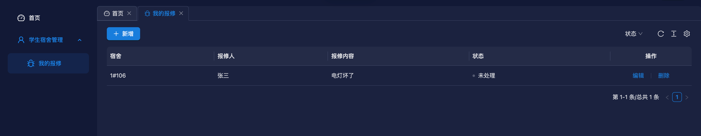
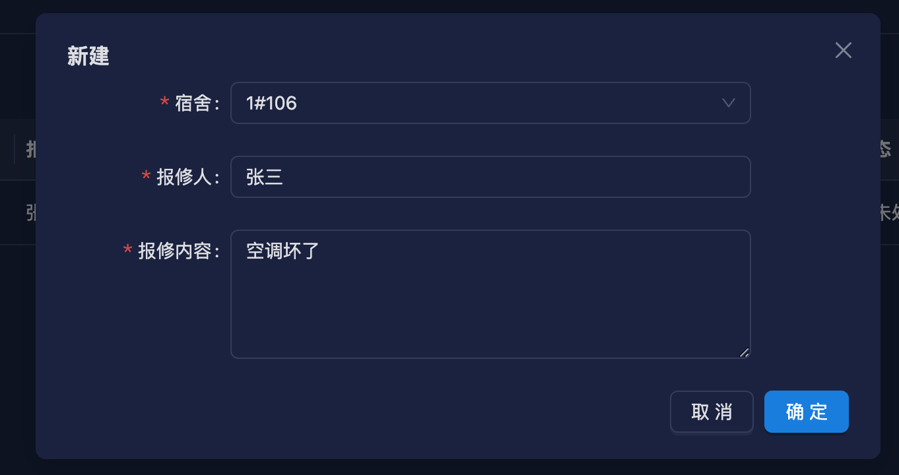

# 我的报修功能开发

使用脚本快速生成增删改查模板代码

```bash
node ./script/create-module student-hostel repair sh 我的报修
```

生成模板代码后，修改数据库实体 `entity`

```ts [src/module/student-hostel/repair/entity/repair.ts]
import {Column, Entity} from 'typeorm';
import {BaseEntity} from '../../../../common/base-entity';

@Entity('sh_repair')
export class RepairEntity extends BaseEntity {
  @Column({comment: '宿舍id'})
  hostelId?: string;
  @Column({comment: '报修人id'})
  repairId?: string;
  @Column({comment: '报修内容', type: 'longtext'})
  repairRemark?: string;
  @Column({comment: '状态，0 未处理，1 已处理'})
  status?: number;
}
```

修改返回给前端的数据模型 `vo`

```ts [src/module/student-hostel/repair/vo/repair.ts]
import {ApiProperty} from '@midwayjs/swagger';
import {BaseVO} from '../../../../common/base-vo';
import {HostelVO} from '../../hostel/vo/hostel';
import {StudentVO} from '../../student/vo/student';

export class RepairVO extends BaseVO {
  @ApiProperty({description: '宿舍id'})
  hostelId?: string;
  @ApiProperty({description: '报修人id'})
  repairId?: string;
  @ApiProperty({description: '报修内容'})
  repairRemark?: string;
  @ApiProperty({description: '状态，0 未处理，1 已处理'})
  status?: number;

  @ApiProperty({description: '报修人', type: StudentVO})
  repair?: StudentVO;

  @ApiProperty({description: '宿舍', type: HostelVO})
  hostel?: HostelVO;
}
```

修改前端传给后端的数据模型 `dto`，并且加上校验规则

```ts [src/module/student-hostel/repair/dto/repair.ts]
import {ApiProperty} from '@midwayjs/swagger';
import {Rule, RuleType} from '@midwayjs/validate';
import {BaseDTO} from '../../../../common/base-dto';
import {R} from '../../../../common/base-error-util';
import {requiredString} from '../../../../common/common-validate-rules';
import {RepairEntity} from '../entity/repair';

export class RepairDTO extends BaseDTO<RepairEntity> {
  @ApiProperty({description: '宿舍id'})
  @Rule(requiredString.error(R.error('hostelId不能为空')))
  hostelId?: string;

  @ApiProperty({description: '报修人id'})
  @Rule(requiredString.error(R.error('报修人id不能为空')))
  repairId?: string;

  @ApiProperty({description: '报修内容'})
  @Rule(requiredString.error(R.error('报修内容不能为空')))
  repairRemark?: string;

  @ApiProperty({description: '状态，0 未处理，1 已处理'})
  status?: number;
}
```

::: tip 注意
@Rule 装饰器可以用来校验前端传过来的数据，如果数据不符合规则，则会返回错误信息。
:::

修改 controller，增加分页查询当前学生报修记录接口

```ts [src/module/student-hostel/repair/controller/repair.ts]
...
  @Get('/page/current', { description: '分页查询当前用户报修单' })
  @ApiOkResponse({
    type: RepairPageVO,
  })
  async pageCurrent(@Query() repairPageDTO: RepairPageDTO) {
    return await this.repairService.pageRepairCurrent(repairPageDTO);
  }
...
```

修改 service 文件，实现分页查询当前学生报修记录方法

```ts [src/module/student-hostel/student/service/student.ts]
async pageRepairCurrent(
    repairPageDTO: RepairPageDTO
  ): Promise<{ data: any[]; total: number }> {
    // 根据当前用户 id 查询用户信息
    const user = await this.userModel.findOneBy({
      id: this.ctx.userInfo.userId,
    });

    // 通过用户手机号关联学生信息
    const student = await this.studentModel.findOneBy({
      phoneNumber: user.phoneNumber,
    });

    if (!student) {
      return {
        data: [],
        total: 0,
      };
    }

    const qb = this.repairModel
      .createQueryBuilder('t')
      .leftJoinAndMapOne('t.repair', StudentEntity, 's', 't.repairId = s.id')
      .leftJoinAndMapOne('t.hostel', HostelEntity, 'h', 't.hostelId = h.id')
      .skip(repairPageDTO.page * repairPageDTO.size)
      .take(repairPageDTO.size)
      .where('t.repairId = :repairId', { repairId: student.id })
      .orderBy('t.createDate', 'DESC');

    if (repairPageDTO.status !== undefined && repairPageDTO.status !== null) {
      qb.andWhere('t.status = :status', {
        status: repairPageDTO.status,
      });
    }

    const [data, total] = await qb.getManyAndCount();

    return {
      data,
      total,
    };
  }
```

打开前端项目，执行生成请求接口方法命令，需要把后端项目先启动起来。

```bash
npm run openapi2ts
```

然后执行创建增删改查模板代码命令

```sh
node ./script/create-page my-repair
```

修改 index.tsx 文件，修改表格列配置

```tsx [src/pages/my-repair/index.tsx]
...
  const columns: ProColumnType<API.RepairVO>[] = [
    {
      dataIndex: 'hostel',
      title: '宿舍',
      renderText(_, record) {
        return [record.hostel?.building, record.hostel?.number].join('#');
      },
      search: false,
    },
    {
      dataIndex: ['repair', 'fullName'],
      title: '报修人',
      search: false,
    },
    {
      dataIndex: 'repairRemark',
      title: '报修内容',
      search: false,
    },
    {
      dataIndex: 'status',
      title: '状态',
      valueType: 'select',
      valueEnum: {
        0: {
          text: "未处理",
          status: 'Default',
        },
        1: {
          text: "已处理",
          status: 'Success',
        },
      },
    },
    {
      title: t("QkOmYwne" /* 操作 */),
      dataIndex: 'id',
      hideInForm: true,
      width: 200,
      align: 'center',
      search: false,
      renderText: (id: string, record) => record.status === 0 ? (
        <Space
          split={(
            <Divider type='vertical' />
          )}
        >
          <LinkButton
            onClick={() => {
              setEditData(record);
              setFormOpen(true);
            }}
          >
            {t("wXpnewYo" /* 编辑 */)}
          </LinkButton>
          <Popconfirm
            title={t("RCCSKHGu" /* 确认删除？ */)}
            onConfirm={async () => {
              const [error] = await repair_remove({ id });
              if (!error) {
                antdUtils.message?.success(t("CVAhpQHp" /* 删除成功! */));
                actionRef.current?.reload();
              }
            }}
            placement="topRight"
          >
            <LinkButton>
              {t("HJYhipnp" /* 删除 */)}
            </LinkButton>
          </Popconfirm>
        </Space>
      ) : <></>,
    },
  ];
  ...
```

修改 new-edit-form.tsx 文件，修改表单配置

```tsx [src/pages/my-repair/new-edit-form.tsx]
import { t } from '@/utils/i18n';
import { Form, Input, Select } from 'antd';
import { useEffect } from 'react';

import { hostel_list } from '@/api/hostel';
import { repair_create, repair_edit } from '@/api/repair';
import FModalForm from '@/components/modal-form';
import { useUserStore } from '@/stores/user';
import { antdUtils } from '@/utils/antd';
import { clearFormValues } from '@/utils/utils';
import { useRequest, useUpdateEffect } from 'ahooks';
import dayjs from 'dayjs';
import { useShallow } from 'zustand/react/shallow';

interface PropsType {
  open: boolean;
  editData?: API.StudentVO | null;
  title: string;
  onOpenChange: (open: boolean) => void;
  onSaveSuccess: () => void;
}

function NewAndEditRepairForm({
  editData,
  open,
  title,
  onOpenChange,
  onSaveSuccess,
}: PropsType) {

  const { userName, userId } = useUserStore(useShallow(user => ({
    userName: user.currentUser?.nickName,
    userId: user.currentUser?.id,
  })));
  const [form] = Form.useForm();
  const { runAsync: updateUser, loading: updateLoading } = useRequest(repair_edit, {
    manual: true,
    onSuccess: () => {
      antdUtils.message?.success(t("NfOSPWDa" /* 更新成功！ */));
      onSaveSuccess();
    },
  });
  const { runAsync: addUser, loading: createLoading } = useRequest(repair_create, {
    manual: true,
    onSuccess: () => {
      antdUtils.message?.success(t("JANFdKFM" /* 创建成功！ */));
      onSaveSuccess();
    },
  });

  const { data: hostelList, run: getHostelList } = useRequest(hostel_list, { manual: true });

  useUpdateEffect(() => {
    if (open) {
      getHostelList({});
    }
  }, [open])

  useEffect(() => {
    if (!editData) {
      clearFormValues(form);
      form.setFieldsValue({
        repairName: userName,
      });
    } else {
      form.setFieldsValue({
        ...editData,
        enrolDate: dayjs(editData?.enrolDate),
        repairName: userName,
      });
    }
  }, [editData, open]);

  const finishHandle = async (values: any) => {

    values.repairId = userId;

    if (editData) {
      updateUser({
        ...editData,
        ...values,
      })
    } else {
      addUser(values)
    }
  }


  return (
    <FModalForm
      labelCol={{ sm: { span: 24 }, md: { span: 5 } }}
      wrapperCol={{ sm: { span: 24 }, md: { span: 16 } }}
      form={form}
      onFinish={finishHandle}
      open={open}
      title={title}
      width={640}
      loading={updateLoading || createLoading}
      onOpenChange={onOpenChange}
      layout='horizontal'
      modalProps={{ forceRender: true }}
    >
      <Form.Item
        label="宿舍"
        name="hostelId"
        rules={[{
          required: true,
          message: t("iricpuxB" /* 不能为空 */),
        }]}
      >
        <Select
          options={hostelList?.map(item => ({
            label: `${item.building}#${item.number}`,
            value: item.id,
          }))}
          onChange={() => {
            form.setFieldValue('bedNum', null);
          }}
          allowClear
        />
      </Form.Item>
      <Form.Item
        label="报修人"
        name="repairName"
        rules={[{
          required: true,
          message: t("iricpuxB" /* 不能为空 */),
        }]}
      >
        <Input readOnly />
      </Form.Item>
      <Form.Item
        label="报修内容"
        name="repairRemark"
        rules={[{
          required: true,
          message: t("iricpuxB" /* 不能为空 */),
        }]}
      >
        <Input.TextArea
          rows={4}
        />
      </Form.Item>
    </FModalForm>
  )
}

export default NewAndEditRepairForm;
```

页面多语言，可以参考[国际化](/guide/i18n)。

启动前端项目，配置菜单和接口权限，这个可以参考[菜单配置](/guide/menu-config)。

功能截图

学生账号




