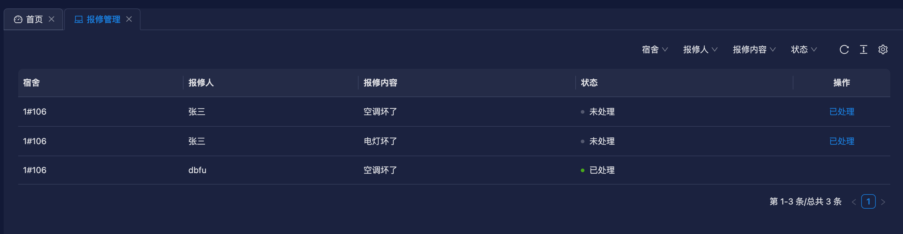
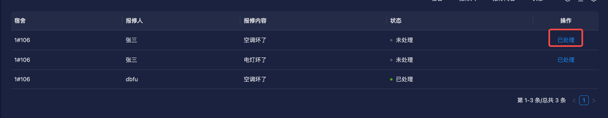

# 报修管理功能开发

管理员可以对学生报修的状态进行修改，如果学生报修的东西，以修复，可以标记为已处理。

这里不用新建一个功能，直接在`src/module/student-hostel/repair/controller/repair.ts`中添加一个查询全部报修的接口。

```ts [src/module/student-hostel/repair/controller/repair.ts]
  ...
  @Get('/page', { description: '分页查询' })
  @ApiOkResponse({
    type: RepairPageVO,
  })
  async page(@Query() repairPageDTO: RepairPageDTO) {
    return await this.repairService.pageRepair(repairPageDTO);
  }
 ...
```

service.ts中添加一个查询全部报修的方法。

```ts [src/module/student-hostel/repair/service/repair.ts]
async pageRepair(
    repairPageDTO: RepairPageDTO
  ): Promise<{ data: any[]; total: number }> {
    const qb = await this.repairModel
      .createQueryBuilder('t')
      .leftJoinAndMapOne('t.repair', StudentEntity, 's', 't.repairId = s.id')
      .leftJoinAndMapOne('t.hostel', HostelEntity, 'h', 't.hostelId = h.id')
      .skip(repairPageDTO.page * repairPageDTO.size)
      .take(repairPageDTO.size)
      .where('1=1')
      .orderBy('t.createDate', 'DESC');

    if (repairPageDTO.hostelNumber) {
      qb.where('h.number like :hostelNumber', {
        hostelNumber: `%${repairPageDTO.hostelNumber}%`,
      });
    }

    if (repairPageDTO.repairName) {
      qb.andWhere('t.repairName like :repairName', {
        repairName: `%${repairPageDTO.repairName}%`,
      });
    }

    if (repairPageDTO.status !== undefined && repairPageDTO.status !== null) {
      qb.andWhere('t.status = :status', {
        status: repairPageDTO.status,
      });
    }

    const [data, total] = await qb.getManyAndCount();

    return {
      data,
      total,
    };
  }
```

打开前端项目，执行生成请求接口方法命令，需要把后端项目先启动起来。

```bash
npm run openapi2ts
```

然后执行创建增删改查模板代码命令

```sh
node ./script/create-page repair
```

修改 index.tsx 文件，修改表格列配置

```tsx [src/pages/repair/index.tsx]
...
  import { t } from '@/utils/i18n';
import {
  Divider,
  Popconfirm,
  Space
} from 'antd';
import { useRef } from 'react';

import { repair_edit, repair_page } from '@/api/repair';
import LinkButton from '@/components/link-button';
import FProTable from '@/components/pro-table';
import { antdUtils } from '@/utils/antd';
import { toPageRequestParams } from '@/utils/utils';
import { ActionType, ProColumnType } from '@ant-design/pro-components';

function RepairPage() {
  const actionRef = useRef<ActionType>();

  const columns: ProColumnType<API.RepairVO>[] = [
    {
      dataIndex: 'hostelNumber',
      title: '宿舍',
      renderText(_, record) {
        return [record.hostel?.building, record.hostel?.number].join('#');
      },
    },
    {
      dataIndex: "repairName",
      title: '报修人',
      renderText(_, record) {
        return record.repair?.fullName;
      },
    },
    {
      dataIndex: 'repairRemark',
      title: '报修内容',
    },
    {
      dataIndex: 'status',
      title: '状态',
      valueType: 'select',
      valueEnum: {
        0: {
          text: "未处理",
          status: 'Default',
        },
        1: {
          text: "已处理",
          status: 'Success',
        },
      },
    },
    {
      title: t("QkOmYwne" /* 操作 */),
      dataIndex: 'id',
      hideInForm: true,
      width: 160,
      align: 'center',
      search: false,
      renderText: (_, record) => record.status === 0 ? (
        <Space
          split={(
            <Divider type='vertical' />
          )}
        >
          <Popconfirm
            title={"已处理？"}
            onConfirm={async () => {
              await repair_edit({ ...record, status: 1 });
              antdUtils.message?.success("处理成功!");
              actionRef.current?.reload();
            }}
            placement="topRight"
          >
            <LinkButton>
              已处理
            </LinkButton>
          </Popconfirm>
        </Space>
      ) : <></>,
    },
  ];

  return (
    <FProTable<API.RepairVO, Omit<API.RepairVO, 'id'>>
      actionRef={actionRef}
      columns={columns}
      request={async params => {
        params.hostel
        return repair_page(
          toPageRequestParams(params)
        );
      }}
    />
  );
}

export default RepairPage;
```

删除 new-edit-form.tsx 文件，因为在报修管理中不能新建。

页面多语言，可以参考[国际化](/guide/i18n)。

启动前端项目，配置菜单和接口权限，这个可以参考[菜单配置](/guide/menu-config)。

功能截图

管理员账号





可以点击已处理按钮，把报修的状态改为已处理。
