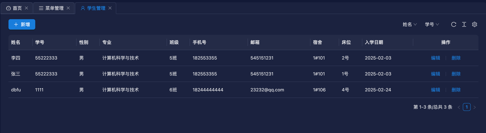
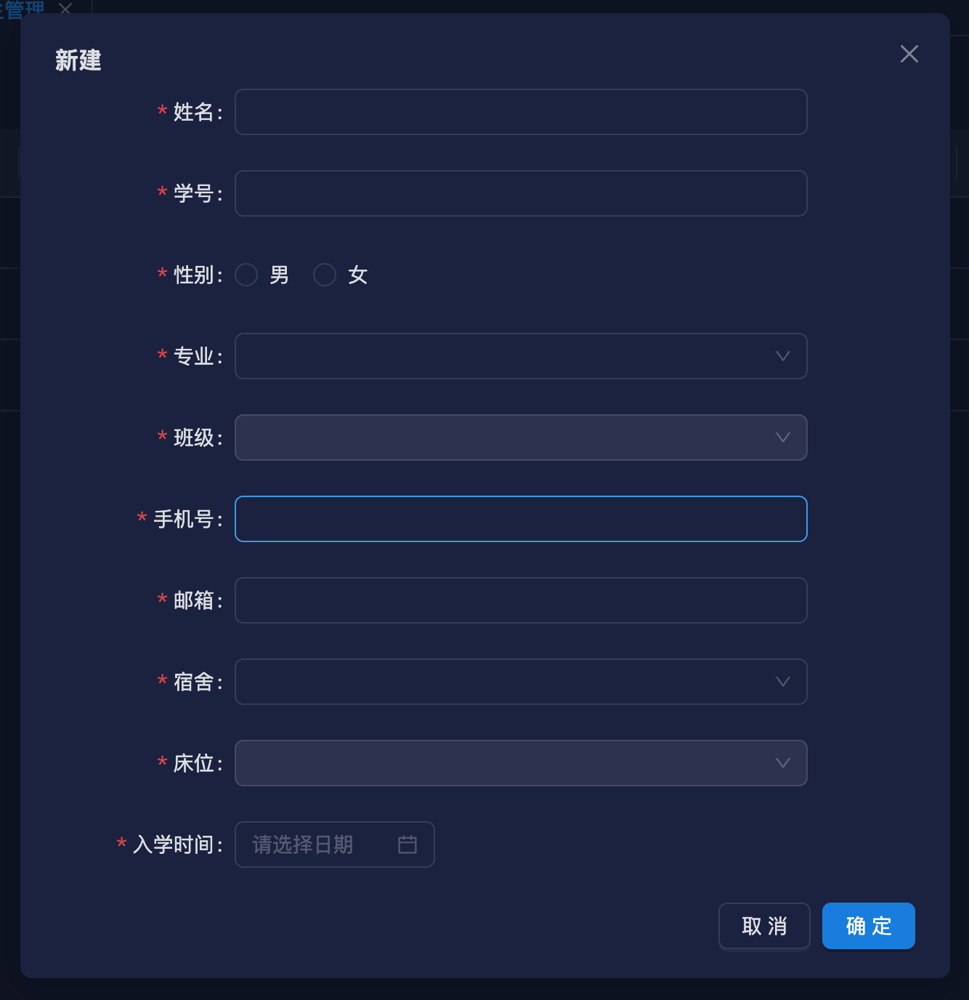
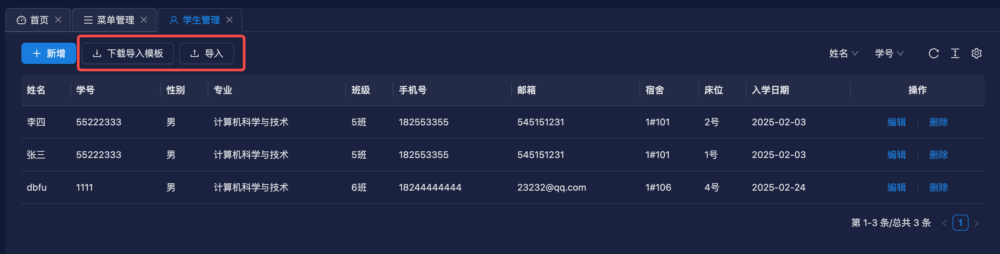
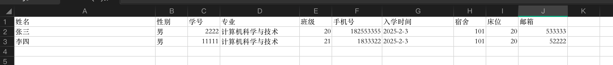
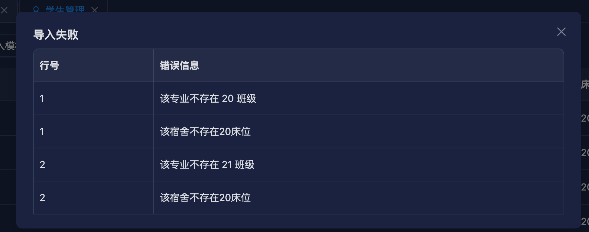

# 学生管理功能开发

使用脚本快速生成增删改查模板代码

```bash
node ./script/create-module student-hostel student sh 学生管理
```

生成模板代码后，修改数据库实体 `entity`

```ts [src/module/student-hostel/student/entity/student.ts]
import {Column, Entity} from 'typeorm';
import {BaseEntity} from '../../../../common/base-entity';

@Entity('sh_student')
export class StudentEntity extends BaseEntity {
  @Column({comment: '姓名'})
  fullName: string;
  @Column({
    comment: '性别',
  })
  sex: number;
  @Column({comment: '学号'})
  code: string;
  @Column({comment: '专业'})
  majorId: string;
  @Column({comment: '班级'})
  classNum: string;
  @Column({comment: '手机号'})
  phoneNumber: string;
  @Column({comment: '入学时间'})
  enrolDate: Date;
  @Column({comment: '宿舍id'})
  hostelId: string;
  @Column({comment: '床位'})
  bedNum: string;
  @Column({comment: '邮箱'})
  email: string;
}
```

::: tip 提示

专业和宿舍这两个字段可以使用 typeorm 表关联查询，但是表关联查询会自动创建外键，我们系统不打算用外键，所以不使用自动关联查询方案。

:::

修改返回给前端的数据模型 `vo`

```ts [src/module/student-hostel/student/vo/student.ts]
import {ApiProperty} from '@midwayjs/swagger';
import {BaseVO} from '../../../../common/base-vo';
import {HostelVO} from '../../hostel/vo/hostel';
import {MajorVO} from '../../major/vo/major';

export class StudentVO extends BaseVO {
  @ApiProperty({description: '姓名'})
  fullName: string;

  @ApiProperty({
    description: '性别',
  })
  sex: number;

  @ApiProperty({description: '专业id'})
  majorId: string;

  @ApiProperty({description: '班级'})
  classNum: string;

  @ApiProperty({description: '手机号'})
  phoneNumber: string;

  @ApiProperty({description: '入学时间'})
  enrolDate: Date;

  @ApiProperty({description: '宿舍id'})
  hostelId: string;

  @ApiProperty({description: '床位'})
  bedNum: number;

  @ApiProperty({description: '邮箱'})
  email: string;

  @ApiProperty({description: '专业'})
  major: MajorVO;

  @ApiProperty({description: '宿舍'})
  hostel: HostelVO;
}
```

修改前端传给后端的数据模型 `dto`，并且加上校验规则

```ts [src/module/student-hostel/student/dto/student.ts]
import {ApiProperty} from '@midwayjs/swagger';
import {Rule, RuleType} from '@midwayjs/validate';
import {BaseDTO} from '../../../../common/base-dto';
import {R} from '../../../../common/base-error-util';
import {
  requiredNumber,
  requiredString,
} from '../../../../common/common-validate-rules';
import {StudentEntity} from '../entity/student';

export class StudentDTO extends BaseDTO<StudentEntity> {
  @ApiProperty({description: '姓名'})
  @Rule(requiredString.error(R.validateError('姓名不能为空')))
  fullName: string;

  @ApiProperty({
    description: '性别',
  })
  @Rule(requiredNumber.error(R.validateError('性别不能为空')))
  sex: number;

  @ApiProperty({description: '专业'})
  @Rule(requiredString.error(R.validateError('专业不能为空')))
  majorId: string;

  @ApiProperty({description: '班级'})
  @Rule(requiredString.error(R.validateError('班级不能为空')))
  classNum: string;

  @ApiProperty({description: '手机号'})
  @Rule(requiredNumber.error(R.validateError('手机号不能为空')))
  phoneNumber: string;

  @ApiProperty({description: '入学时间'})
  @Rule(RuleType.date().required().error(R.validateError('入学时间不能为空')))
  enrolDate: Date;

  @ApiProperty({description: '宿舍id'})
  @Rule(requiredString.error(R.validateError('宿舍不能为空')))
  hostelId: string;

  @ApiProperty({description: '床位'})
  @Rule(requiredString.error(R.validateError('床位不能为空')))
  bedNum: number;

  @ApiProperty({description: '邮箱'})
  @Rule(requiredString.error(R.validateError('邮箱不能为空')))
  email: number;

  @ApiProperty({description: '学号'})
  @Rule(requiredString.error(R.validateError('学号不能为空')))
  code: string;
}
```

::: tip 注意
@Rule 装饰器可以用来校验前端传过来的数据，如果数据不符合规则，则会返回错误信息。
:::

修改 controller，分页查询接口支持姓名和学号查询

```ts [src/module/student-hostel/student/controller/student.ts]
...
@Get('/page', { description: '分页查询' })
  @ApiOkResponse({
    type: StudentPageVO,
  })
  async page(@Query() studentPageDTO: StudentPageDTO) {
    const filterQuery = new FilterQuery<StudentEntity>();
    filterQuery.append(
      'fullName',
      like(studentPageDTO.fullName),
      !!studentPageDTO.fullName
    );

    filterQuery.append(
      'code',
      like(studentPageDTO.code),
      !!studentPageDTO.code
    );

    return await this.studentService.page(studentPageDTO, {
      where: filterQuery.where,
      order: { createDate: 'DESC' },
    });
  }
...
```

修改 service 文件，重写 page、create、remove 方法

```ts [src/module/student-hostel/student/service/student.ts]
import {NodeRedisWatcher} from '@midwayjs/casbin-redis-adapter';
import {CasbinRule} from '@midwayjs/casbin-typeorm-adapter';
import {Inject, Provide} from '@midwayjs/decorator';
import {InjectEntityModel} from '@midwayjs/typeorm';
import * as bcrypt from 'bcryptjs';
import {FindManyOptions, Repository} from 'typeorm';
import * as XLSX from 'xlsx';
import {BaseService} from '../../../../common/base-service';
import {PageDTO} from '../../../../common/page-dto';
import {AssertUtils} from '../../../../utils/assert';
import {RoleEntity} from '../../../system/role/entity/role';
import {UserDTO} from '../../../system/user/dto/user';
import {UserEntity} from '../../../system/user/entity/user';
import {UserRoleEntity} from '../../../system/user/entity/user-role';
import {UserService} from '../../../system/user/service/user';
import {HostelEntity} from '../../hostel/entity/hostel';
import {MajorEntity} from '../../major/entity/major';
import {StudentEntity} from '../entity/student';

@Provide()
export class StudentService extends BaseService<StudentEntity> {
  @InjectEntityModel(StudentEntity)
  studentModel: Repository<StudentEntity>;
  @Inject()
  userService: UserService;
  @Inject()
  casbinWatcher: NodeRedisWatcher;

  getModel(): Repository<StudentEntity> {
    return this.studentModel;
  }

  async page(
    pageDTO: PageDTO,
    options?: FindManyOptions<StudentEntity>
  ): Promise<{data: any[]; total: number}> {
    // 使用leftJoinAndMapOne可以把关联的专业和宿舍信息查出来，映射到major和hostel字段上。
    const [data, total] = await this.studentModel
      .createQueryBuilder('student')
      .leftJoinAndMapOne(
        'student.major',
        MajorEntity,
        'major',
        'student.majorId = major.id'
      )
      .leftJoinAndMapOne(
        'student.hostel',
        HostelEntity,
        'hostel',
        'student.hostelId = hostel.id'
      )
      .where(options?.where)
      .orderBy('student.createDate', 'DESC')
      .skip(pageDTO.page * pageDTO.size)
      .take(pageDTO.size)
      .getManyAndCount();
    return {
      data,
      total,
    };
  }

  async removeById(id: string) {
    // 使用事物
    await this.defaultDataSource.transaction(async (manager) => {
      const student = await manager.findOneBy(StudentEntity, {
        id,
      });

      await manager
        .createQueryBuilder()
        .delete()
        .from(StudentEntity)
        .where({id})
        .execute();

      await manager
        .createQueryBuilder()
        .delete()
        .from(UserEntity)
        .where({phoneNumber: student.phoneNumber})
        .execute();
    });
  }

  // 创建学生，同时为学生创建一个登录账号，并且给分配学生角色。
  async create(entity: StudentEntity) {
    const count = await this.studentModel.count({
      where: {
        hostelId: entity.hostelId,
        bedNum: entity.bedNum,
      },
    });

    AssertUtils.isTrue(count === 0, '该宿舍当前床位已被分配');

    const userDTO = new UserDTO();

    userDTO.nickName = entity.fullName;
    userDTO.phoneNumber = entity.phoneNumber;
    userDTO.userName = entity.code;
    userDTO.email = entity.email;

    return await this.defaultDataSource.transaction(async (manager) => {
      await manager.save(StudentEntity, entity);

      const studentRole = await manager.findOneBy(RoleEntity, {
        code: 'student',
      });

      if (studentRole) {
        userDTO.roleIds = [studentRole.id];
        await this.userService.createUser(userDTO);
      }

      return entity;
    });
  }
}
```

打开前端项目，执行生成请求接口方法命令，需要把后端项目先启动起来。

```bash
npm run openapi2ts
```

然后执行创建增删改查模板代码命令

```sh
node ./script/create-page student
```

修改 index.tsx 文件，修改表格列配置

```tsx [src/pages/student/index.tsx]
...
const columns: ProColumnType<API.StudentVO>[] = [
    {
      dataIndex: 'fullName',
      title: t("iHiMUzEr" /* 姓名 */),
    },
    {
      dataIndex: 'code',
      title: t("JTDacbUB" /* 学号 */),
    },
    {
      dataIndex: 'sex',
      title: t("ykrQSYRh" /* 性别 */),
      renderText(text) {
        return text === 1 ? t("AkkyZTUy" /* 男 */) : t("yduIcxbx" /* 女 */);
      },
      search: false,
    },
    {
      dataIndex: ['major', 'name'],
      title: t("mCsnYkSS" /* 专业 */),
      search: false,
    },
    {
      dataIndex: 'classNum',
      title: t("ucwGleiK" /* 班级 */),
      renderText(text) {
        return text + t("HEpbQBFB" /* 班 */);
      },
      search: false,
    },
    {
      dataIndex: 'phoneNumber',
      title: t("SPsRnpyN" /* 手机号 */),
      search: false,
    },
    {
      dataIndex: 'email',
      title: t("XWVvMWig" /* 邮箱 */),
      search: false,
    },
    {
      dataIndex: 'hostel',
      title: t("MCeuTXqz" /* 宿舍 */),
      search: false,
      renderText(_, record) {
        return [record.hostel?.building, record.hostel?.number].join('#')
      },
    },
    {
      dataIndex: 'bedNum',
      title: t("yBrYgKOg" /* 床位 */),
      search: false,
      renderText(text) {
        return text + t("PxaFmeun" /* 号 */);
      },
    },
    {
      dataIndex: 'enrolDate',
      title: t("ZzDpEjzU" /* 入学日期 */),
      valueType: 'date',
      search: false,
    },
    {
      title: t("QkOmYwne" /* 操作 */),
      dataIndex: 'id',
      hideInForm: true,
      width: 200,
      align: 'center',
      search: false,
      renderText: (id: string, record) => (
        <Space
          split={(
            <Divider type='vertical' />
          )}
        >
          <LinkButton
            onClick={() => {
              setEditData(record);
              setFormOpen(true);
            }}
          >
            {t("wXpnewYo" /* 编辑 */)}
          </LinkButton>
          <Popconfirm
            title={t("RCCSKHGu" /* 确认删除？ */)}
            onConfirm={async () => {
              const [error] = await student_remove({ id });
              if (!error) {
                antdUtils.message?.success(t("CVAhpQHp" /* 删除成功! */));
                actionRef.current?.reload();
              }
            }}
            placement="topRight"
          >
            <LinkButton>
              {t("HJYhipnp" /* 删除 */)}
            </LinkButton>
          </Popconfirm>
        </Space>
      ),
    },
  ];
  ...
```

修改 new-edit-form.tsx 文件，修改表单配置

```tsx [src/pages/student/new-edit-form.tsx]
import {t} from '@/utils/i18n';
import {DatePicker, Form, Input, Radio, Select} from 'antd';
import {useEffect, useMemo, useState} from 'react';

import {hostel_list} from '@/api/hostel';
import {major_list} from '@/api/major';
import {student_create, student_edit} from '@/api/student';
import FModalForm from '@/components/modal-form';
import {antdUtils} from '@/utils/antd';
import {clearFormValues} from '@/utils/utils';
import {useRequest, useUpdateEffect} from 'ahooks';
import dayjs from 'dayjs';

interface PropsType {
  open: boolean;
  editData?: API.StudentVO | null;
  title: string;
  onOpenChange: (open: boolean) => void;
  onSaveSuccess: () => void;
}

function NewAndEditStudentForm({
  editData,
  open,
  title,
  onOpenChange,
  onSaveSuccess,
}: PropsType) {
  const [formValues, setFormValues] = useState<any>({});

  const [form] = Form.useForm();
  const {runAsync: updateUser, loading: updateLoading} = useRequest(
    student_edit,
    {
      manual: true,
      onSuccess: () => {
        antdUtils.message?.success(t('NfOSPWDa' /* 更新成功！ */));
        onSaveSuccess();
      },
    }
  );
  const {runAsync: addUser, loading: createLoading} = useRequest(
    student_create,
    {
      manual: true,
      onSuccess: () => {
        antdUtils.message?.success(t('JANFdKFM' /* 创建成功！ */));
        onSaveSuccess();
      },
    }
  );

  const {data: majorList, run: getMajorList} = useRequest(major_list, {
    manual: true,
  });
  const {data: hostelList, run: getHostelList} = useRequest(hostel_list, {
    manual: true,
  });

  useUpdateEffect(() => {
    if (open) {
      getMajorList({});
      getHostelList({});
    }
  }, [open]);

  useEffect(() => {
    if (!editData) {
      clearFormValues(form);
      setFormValues({});
    } else {
      form.setFieldsValue({
        ...editData,
        enrolDate: dayjs(editData?.enrolDate),
      });
      setFormValues({
        ...editData,
        enrolDate: dayjs(editData?.enrolDate),
      });
    }
  }, [editData]);

  const classCount = useMemo(() => {
    return majorList?.find((item) => item.id === formValues.majorId)
      ?.classCount;
  }, [formValues]);

  const bedCount = useMemo(() => {
    return hostelList?.find((item) => item.id === formValues.hostelId)
      ?.bedCount;
  }, [formValues]);

  const finishHandle = async (values: any) => {
    if (editData) {
      updateUser({...editData, ...values});
    } else {
      addUser(values);
    }
  };

  return (
    <FModalForm
      labelCol={{sm: {span: 24}, md: {span: 5}}}
      wrapperCol={{sm: {span: 24}, md: {span: 16}}}
      form={form}
      onFinish={finishHandle}
      open={open}
      title={title}
      width={640}
      loading={updateLoading || createLoading}
      onOpenChange={onOpenChange}
      layout='horizontal'
      modalProps={{forceRender: true}}
      onValuesChange={(_, allValues) => {
        setFormValues(allValues);
      }}
    >
      <Form.Item
        label='姓名'
        name='fullName'
        rules={[
          {
            required: true,
            message: t('iricpuxB' /* 不能为空 */),
          },
        ]}
      >
        <Input />
      </Form.Item>
      <Form.Item
        label='学号'
        name='code'
        rules={[
          {
            required: true,
            message: t('iricpuxB' /* 不能为空 */),
          },
        ]}
      >
        <Input />
      </Form.Item>
      <Form.Item
        label='性别'
        name='sex'
        rules={[
          {
            required: true,
            message: t('iricpuxB' /* 不能为空 */),
          },
        ]}
      >
        <Radio.Group
          options={[
            {
              label: '男',
              value: 1,
            },
            {
              label: '女',
              value: 0,
            },
          ]}
        />
      </Form.Item>
      <Form.Item
        label='专业'
        name='majorId'
        rules={[
          {
            required: true,
            message: t('iricpuxB' /* 不能为空 */),
          },
        ]}
      >
        <Select
          options={majorList?.map((item) => ({
            label: item.name,
            value: item.id,
          }))}
          onChange={() => {
            form.setFieldValue('classNum', null);
          }}
        />
      </Form.Item>
      <Form.Item
        label='班级'
        name='classNum'
        rules={[
          {
            required: true,
            message: t('iricpuxB' /* 不能为空 */),
          },
        ]}
      >
        <Select
          disabled={!classCount}
          options={Array.from({length: classCount || 0}, (_, i) => i + 1).map(
            (item) => ({
              label: `${item}班`,
              value: `${item}`,
            })
          )}
        />
      </Form.Item>
      <Form.Item
        label='手机号'
        name='phoneNumber'
        rules={[
          {
            required: true,
            message: t('iricpuxB' /* 不能为空 */),
          },
          {
            pattern:
              /^(13[0-9]|14[5-9]|15[0-3,5-9]|16[2567]|17[0-8]|18[0-9]|19[89])\d{8}$/,
            message: t('AnDwfuuT' /* 手机号格式不正确 */),
          },
        ]}
      >
        <Input />
      </Form.Item>
      <Form.Item
        label='邮箱'
        name='email'
        rules={[
          {
            required: true,
            message: t('iricpuxB' /* 不能为空 */),
          },
          {
            pattern: /^[a-zA-Z0-9._%+-]+@[a-zA-Z0-9.-]+\.[a-zA-Z]{2,}$/,
            message: t('EfwYKLsR' /* 邮箱格式不正确 */),
          },
        ]}
      >
        <Input />
      </Form.Item>
      <Form.Item
        label='宿舍'
        name='hostelId'
        rules={[
          {
            required: true,
            message: t('iricpuxB' /* 不能为空 */),
          },
        ]}
      >
        <Select
          options={hostelList?.map((item) => ({
            label: `${item.building}#${item.number}`,
            value: item.id,
          }))}
          onChange={() => {
            form.setFieldValue('bedNum', null);
          }}
          allowClear
        />
      </Form.Item>
      <Form.Item
        label='床位'
        name='bedNum'
        rules={[
          {
            required: true,
            message: t('iricpuxB' /* 不能为空 */),
          },
        ]}
      >
        <Select
          disabled={!bedCount}
          options={Array.from({length: bedCount || 0}, (_, i) => i + 1).map(
            (item) => ({
              label: `${item}号床`,
              value: `${item}`,
            })
          )}
          allowClear
        />
      </Form.Item>
      <Form.Item
        label='入学时间'
        name='enrolDate'
        rules={[
          {
            required: true,
            message: t('iricpuxB' /* 不能为空 */),
          },
        ]}
      >
        <DatePicker />
      </Form.Item>
    </FModalForm>
  );
}

export default NewAndEditStudentForm;
```

页面多语言，可以参考[国际化](/guide/i18n)。

启动前端项目，配置菜单和接口权限，这个可以参考[菜单配置](/guide/menu-config)。

功能截图





一般每次开学学生比较多，一条一条录，太麻烦了，所以我们来实现导入功能。

实现导入功能之前，需要先实现下载导入模板功能。

实现导入导出 excel，我这里使用的是`xlsx`库

在 controller 里添加一个新接口

```ts [src/module/student-hostel/student/controller/student.ts]
import * as XLSX from 'xlsx';

...

@Post('/export/template', { description: '下载模板' })
  @SetHeader({
    'Content-Type':
      'application/vnd.openxmlformats-officedocument.spreadsheetml.sheet',
    'Content-Disposition': 'attachment; filename=student.xlsx',
  })
  async downloadTemplate() {
    const colums = [
      [
        '姓名',
        '性别',
        '学号',
        '专业',
        '班级',
        '手机号',
        '入学时间',
        '宿舍',
        '床位',
        '邮箱',
      ],
    ];

    const workbook = XLSX.utils.book_new();
    const worksheet = XLSX.utils.aoa_to_sheet(colums);
    XLSX.utils.book_append_sheet(workbook, worksheet, '学生信息模板');
    const buffer = XLSX.write(workbook, { bookType: 'xlsx', type: 'buffer' });

    return buffer;
  }
...
```

前端使用`file-saver`库，把后端返回的 buffer 写入文件

```ts
async function downloadTemplate() {
  const data = await axios('/student/export/template', {
    method: 'POST',
    responseType: 'blob',
  });

  const blob = new Blob([data]);
  FileSaver.saveAs(blob, '学生信息模板.xlsx');
}
```

实现导入功能，在 controller 中添加一个新接口

```ts
  @Post('/import', { description: '导入' })
  async import(@Files() files) {
    AssertUtils.arrNotEmpty(files, '请上传文件');
    const [file] = files;

    return this.studentService.import(file.data);
  }
```

在 service 中实现导入功能

```ts
async import(filePath: string) {
    const workbook = XLSX.readFile(filePath);
    // 获取第一个工作表的名称
    const sheetName = workbook.SheetNames[0];
    // 获取工作表对象
    const worksheet = workbook.Sheets[sheetName];
    // 将工作表转换为 JSON 格式
    const jsonData = XLSX.utils.sheet_to_json(worksheet);

    const errorMessages = [];

    const majorList = await this.defaultDataSource
      .getRepository(MajorEntity)
      .find();

    const majorNameMap = majorList.reduce((prev, cur) => {
      prev[cur.name] = cur;
      return prev;
    }, {});

    const hostelList = await this.defaultDataSource
      .getRepository(HostelEntity)
      .find();

    const hostelNameMap = hostelList.reduce((prev, cur) => {
      prev[cur.number] = cur;
      return prev;
    }, {});

    const columns = {
      姓名: {
        validate: (value, row) => {
          if (!value) {
            return [
              {
                row,
                message: '姓名不能为空',
              },
            ];
          }
        },
      },
      性别: {
        validate: (value, row) => {
          if (!value) {
            return [
              {
                row,
                message: '性别不能为空',
              },
            ];
          }
        },
        transform: value => {
          return value === '男' ? 1 : 0;
        },
      },
      学号: {
        validate: (value, row) => {
          if (!value) {
            return [
              {
                row,
                message: '学号不能为空',
              },
            ];
          }
        },
      },
      班级: {
        validate: (value, row, record) => {
          if (!value) {
            return [
              {
                row,
                message: '班级不能为空',
              },
            ];
          }

          if (
            majorNameMap[record['专业']] &&
            +value > majorNameMap[record['专业']].classCount
          ) {
            return [
              {
                row,
                message: `该专业不存在 ${value} 班级`,
              },
            ];
          }
        },
      },
      专业: {
        validate: (value, row) => {
          if (!value) {
            return [
              {
                row,
                message: '专业不能为空',
              },
            ];
          }

          if (!majorNameMap[value]) {
            return [
              {
                row,
                message: `系统中不存在 ${value} 专业`,
              },
            ];
          }
        },
        transform: value => {
          return majorNameMap[value].id;
        },
      },
      手机号: {
        validate: (value, row) => {
          if (!value) {
            return [
              {
                row,
                message: '手机号不能为空',
              },
            ];
          }
        },
      },
      入学时间: {
        validate: (value, row) => {
          if (!value) {
            return [
              {
                row,
                message: '入学时间不能为空',
              },
            ];
          }
        },
        transform: value => {
          return new Date(value);
        },
      },
      宿舍: {
        validate: (value, row) => {
          if (!value) {
            return [
              {
                row,
                message: '宿舍不能为空',
              },
            ];
          }

          if (!hostelNameMap[value]) {
            return [
              {
                row,
                message: `系统中不存在 ${value} 宿舍`,
              },
            ];
          }
        },
        transform: value => {
          return hostelNameMap[value].id;
        },
      },
      床位: {
        validate: (value, row, record) => {
          if (!value) {
            return [
              {
                row,
                message: '床位不能为空',
              },
            ];
          }

          if (
            hostelNameMap[record['宿舍']] &&
            +value > hostelNameMap[record['宿舍']].bedCount
          ) {
            return [
              {
                row,
                message: `该宿舍不存在${value}床位`,
              },
            ];
          }
        },
      },
      邮箱: {
        validate: (value, row) => {
          if (!value) {
            return [
              {
                row,
                message: '邮箱不能为空',
              },
            ];
          }
        },
      },
    };

    jsonData.forEach((item, index) => {
      Object.keys(columns).forEach(col => {
        const errors = columns[col].validate(item[col], index + 1, item) || [];
        if (errors?.length) {
          errorMessages.push(...errors);
          return;
        }

        if (columns[col].transform) {
          item[col] = columns[col].transform(item[col], item);
        }
      });
    });

    // TODO 数据重复性校验，比如学号、手机号、邮箱

    if (errorMessages.length) {
      return {
        success: false,
        message: errorMessages.map((item, index) => ({
          id: index + 1,
          ...item,
        })),
      };
    }

    const students = [];
    const users = [];

    const studentRole = await this.defaultDataSource
      .getRepository(RoleEntity)
      .findOneBy({
        code: 'student',
      });

    jsonData.forEach(item => {
      const student = new StudentEntity();
      student.fullName = item['姓名'];
      student.sex = item['性别'];
      student.code = item['学号'];
      student.majorId = item['专业'];
      student.classNum = item['班级'];
      student.hostelId = item['宿舍'];
      student.bedNum = item['床位'];
      student.enrolDate = item['入学时间'];
      student.email = item['邮箱'];
      student.phoneNumber = item['手机号'];

      const user = new UserEntity();
      user.userName = item['学号'];
      user.nickName = item['姓名'];
      user.email = item['邮箱'];
      user.phoneNumber = item['手机号'];
      const hashPassword = bcrypt.hashSync('123456', 10);
      user.password = hashPassword;

      users.push(user);
      students.push(student);
    });

    await this.defaultDataSource.transaction(async manager => {
      await manager.save(StudentEntity, students);
      await manager.save(UserEntity, users);

      const userRoles = users.map(u => {
        const userRole = new UserRoleEntity();
        userRole.userId = u.id;
        userRole.roleId = studentRole.id;
        return userRole;
      });

      const casbinRules = users.map(u => {
        const casbinRule = new CasbinRule();
        casbinRule.ptype = 'g';
        casbinRule.v0 = u.id;
        casbinRule.v1 = studentRole.id;
        return casbinRule;
      });

      await manager.save(UserRoleEntity, userRoles);
      await manager.save(CasbinRule, casbinRules);
    });

    // 发消息给其它进程，同步最新的策略
    this.casbinWatcher.publishData();

    return {
      success: true,
    };
  }
```

前端实现

```tsx
...
async function customRequest(options: any) {
    const formData = new FormData();
    formData.append("file", options.file);
    const data = await axios('/student/import', {
      data: formData,
      method: 'POST',
    });
    if (!data.success) {
      setImportErrorMessageData(data.message);
      setImportErrorMessageOpen(true);
    } else {
      antdUtils.message?.success(t("CdCRuEui" /* 导入成功! */));
      actionRef.current?.reload();
    }
  }
...
<Upload customRequest={customRequest} fileList={[]}>
  <Button icon={<UploadOutlined />}>{t('ZjPaWYIx' /* 导入 */)}</Button>
</Upload>
```

添加一个弹框组件，显示错误信息

```tsx [src/pages/student/import-error-message.tsx]
import {Modal, Table} from 'antd';

interface PropsType {
  data: {message: string; row: string}[];
  setOpen: (open: boolean) => void;
  open: boolean;
}

function ImportErrorMessageModal({data, open, setOpen}: PropsType) {
  return (
    <Modal
      title='导入失败'
      open={open}
      onOk={() => {
        setOpen(false);
      }}
      onCancel={() => {
        setOpen(false);
      }}
      width={800}
      footer={null}
    >
      <Table
        rowKey='id'
        dataSource={data}
        columns={[
          {title: '行号', dataIndex: 'row'},
          {title: '错误信息', dataIndex: 'message'},
        ]}
        pagination={false}
        bordered
      />
    </Modal>
  );
}

export default ImportErrorMessageModal;
```






